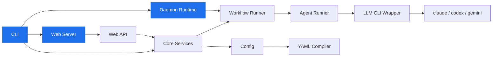

<div align="center">


<br/>

[](https://github.com/launchapp-dev/ao)

<br/>
<br/>

<a href="https://github.com/launchapp-dev/ao/releases/latest"></a>
&nbsp;

&nbsp;

&nbsp;
<a href="https://github.com/launchapp-dev/awesome-ai-coding-tools"></a>

</div>

<p align="center">
<sub>AI agent orchestrator | autonomous coding agents | multi-model AI dev team | Claude + Gemini + GPT workflow automation | MCP integration | YAML-driven CI for AI | Rust CLI</sub>
</p>

<br/>

## Install — 30 seconds

### One paste, any agent

Open a fresh **Claude Code** (or **Codex** / **OpenCode** / **Cursor**) session and paste this. The agent installs the Animus CLI, clones `animus-skills`, runs the setup script, and adds the project section to `CLAUDE.md` / `AGENTS.md`. You'll be running workflows in about a minute.

> Install Animus + Animus Skills: run **`curl -fsSL https://raw.githubusercontent.com/launchapp-dev/ao/main/install.sh | bash`** to install the `animus` CLI, then **`git clone --single-branch --depth 1 https://github.com/launchapp-dev/animus-skills.git ~/.claude/skills/animus-skills && cd ~/.claude/skills/animus-skills && ./setup`** to link the skills and write `.mcp.json`. Then add an "Animus" section to CLAUDE.md (or AGENTS.md for Codex) listing the slash commands: `/animus-setup`, `/animus-getting-started`, `/animus-mcp-setup`, `/animus-workflow-authoring`, `/animus-pack-authoring`, `/animus-skill-authoring`, `/animus-troubleshooting`. Restart the agent so the new `animus` MCP server is picked up. From a project root, run `/animus-setup` to scaffold `.animus/` and the first workflow.

For Codex CLI, swap the clone path to `~/.codex/skills/animus-skills` and edit `AGENTS.md` instead of `CLAUDE.md`.

### Manual install (no agent)

```bash
curl -fsSL https://raw.githubusercontent.com/launchapp-dev/ao/main/install.sh | bash
```

The upstream installer currently targets macOS. On Linux and Windows, use a release archive or build from source.

<details>
<summary><kbd>options</kbd></summary>

```bash
# Specific version
AO_VERSION=v0.3.0 curl -fsSL https://raw.githubusercontent.com/launchapp-dev/ao/main/install.sh | bash

# Custom directory
AO_INSTALL_DIR=/usr/local/bin curl -fsSL https://raw.githubusercontent.com/launchapp-dev/ao/main/install.sh | bash
```

</details>

<details>
<summary><kbd>prerequisites</kbd></summary>

You need at least one AI coding CLI:

```bash
npm install -g @anthropic-ai/claude-code    # Claude (recommended)
npm install -g @openai/codex                # Codex
npm install -g @google/gemini-cli           # Gemini
```

</details>

---

## What is Animus?

Animus turns a single YAML file into an autonomous software delivery pipeline.

You define agents, wire them into phases, compose phases into workflows, schedule everything with cron — and Animus's daemon handles the rest: dispatching tasks to AI agents in isolated git worktrees, managing quality gates, and merging the results.

As of v0.4.0, Animus is plugin-first. The core daemon is the orchestration runtime; providers (Claude, Codex, Gemini, OpenCode, any OpenAI-compatible HTTP endpoint) and subject backends (native task queue, Linear, anything you scaffold from the template) ship as independent `animus-*` repositories under [launchapp-dev](https://github.com/launchapp-dev). `animus plugin install <owner/repo>` pulls them in.

```
                ┌──────────────────────────────────────────────────┐
                │            Animus Daemon (Rust)                  │
                │                                                  │
  ┌────────┐    │    ┌───────────┐    ┌───────────┐    ┌────────┐ │    ┌────────┐
  │ Tasks  │───▶│───▶│  Dispatch │───▶│  Agents   │───▶│ Phases │─│──▶│  PRs   │
  │        │    │    │  Queue    │    │           │    │        │ │    │        │
  │ TASK-1 │    │    │ priority  │    │ Claude    │    │ impl   │ │    │ PR #42 │
  │ TASK-2 │    │    │ routing   │    │ Codex     │    │ review │ │    │ PR #43 │
  │ TASK-3 │    │    │ capacity  │    │ Gemini    │    │ test   │ │    │ PR #44 │
  └────────┘    │    └───────────┘    └───────────┘    └────────┘ │    └────────┘
                │                                                  │
                │    Schedules: work-planner (5m), pr-reviewer     │
                │    (5m), reconciler (5m), PO scans (2-8h)        │
                └──────────────────────────────────────────────────┘
```

---

## Quick Start

```bash
cd your-project                                  # any git repo
animus doctor                                    # check prerequisites and auto-remediate
animus init --template task-queue --non-interactive   # scaffold .animus/ from the task-queue template

# Option 1: run a workflow on demand
animus task create --title "Add rate limiting" --task-type feature --priority high
animus workflow run --task-id TASK-001

# Option 2: go fully autonomous
animus daemon start --autonomous                 # daemon executes ready tasks continuously
animus daemon health                             # verify it's up

# Install a provider plugin from a public GitHub release:
animus plugin install launchapp-dev/animus-provider-claude

# Scaffold a brand-new subject backend (Jira, Notion, anything with an API):
animus plugin new --kind subject --name jira
```

Bundled `init` templates: **`task-queue`**, **`conductor`**, **`direct-workflow`**.

---

## Everything in One YAML

<table>
<tr>
<td width="50%">

### Agents

Bind models, tools, MCP servers, and system prompts to named profiles. Route by task complexity.

```yaml
agents:
  default:
    model: claude-sonnet-4-6
    tool: claude
    mcp_servers: ["animus", "context7"]

  work-planner:
    system_prompt: |
      Scan tasks, check dependencies,
      enqueue ready work for the daemon.
    model: claude-sonnet-4-6
    tool: claude
```

</td>
<td width="50%">

### Phases

Reusable execution units. Three modes: **agent** (AI with decision contracts), **command** (shell), **manual** (human gate).

```yaml
phases:
  implementation:
    mode: agent
    agent: default
    directive: "Implement production code."
    decision_contract:
      min_confidence: 0.7
      max_risk: medium

  push-branch:
    mode: command
    command:
      program: git
      args: ["push", "-u", "origin", "HEAD"]
```

</td>
</tr>
<tr>
<td width="50%">

### Workflows

Compose phases into pipelines with skip conditions and post-success hooks.

```yaml
workflows:
  - id: standard
    phases:
      - requirements
      - implementation
      - push-branch
      - create-pr
    post_success:
      merge:
        strategy: squash
        auto_merge: true
        cleanup_worktree: true
```

</td>
<td width="50%">

### Schedules & Triggers

Cron-based autonomous execution and event-driven triggers. Trigger types: `file_watcher`, `webhook` (generic HTTP), `github_webhook` (with event filtering).

```yaml
schedules:
  - id: work-planner
    cron: "*/5 * * * *"
    workflow_ref: work-planner
    enabled: true

triggers:
  - id: pr-opened
    type: github_webhook
    workflow_ref: pr-reviewer
    enabled: true
    config:
      events: ["pull_request"]
```

</td>
</tr>
</table>

---

## The Full Agent Team

Animus doesn't run one agent. It runs an **entire product organization**:

```
  ┌─────────────────────────────────────────────────────────────────┐
  │                                                                 │
  │   Planners               Builders              Reviewers        │
  │   ╭──────────────╮       ╭──────────────╮       ╭──────────────╮│
  │   │ Work Planner │       │ Claude Eng   │       │ PR Reviewer  ││
  │   │ Reconciler   │       │ Codex Eng    │       │ PO Reviewer  ││
  │   │ Triager      │       │ Gemini Eng   │       │ Code Review  ││
  │   │ Req Refiner  │       │ GLM Eng      │       │              ││
  │   ╰──────────────╯       ╰──────────────╯       ╰──────────────╯│
  │                                                                 │
  │   Product Owners         Architects             Operations      │
  │   ╭──────────────╮       ╭──────────────╮       ╭──────────────╮│
  │   │ PO: Web      │       │ Rust Arch    │       │ Sys Monitor  ││
  │   │ PO: MCP      │       │ Infra Arch   │       │ Release Mgr  ││
  │   │ PO: Workflow │       │              │       │ Branch Sync  ││
  │   │ PO: CLI      │       │              │       │ Doc Drift    ││
  │   │ PO: Runner   │       │              │       │ Wf Optimizer ││
  │   ╰──────────────╯       ╰──────────────╯       ╰──────────────╯│
  │                                                                 │
  └─────────────────────────────────────────────────────────────────┘
```

## Key Concepts

<table>
<tr>
<td width="33%">

**Decision Contracts**

Every agent phase returns a typed verdict: `advance`, `rework`, `skip`, or `fail`. Rework loops pass the reviewer's feedback back to the implementer. Configurable `max_rework_attempts` prevents infinite loops.

</td>
<td width="33%">

**Model Routing**

Route tasks to different models by type and complexity. Low-priority bugfixes go to cheap models. Critical architecture tasks go to Opus. The work-planner agent manages this automatically.

</td>
<td width="33%">

**Worktree Isolation**

Every task gets its own git worktree. Agents work in parallel on separate branches without conflicts. Post-success hooks handle merge, cleanup, and PR creation.

</td>
</tr>
</table>

| Complexity | Type | Model | Why |
|:---|:---|:---|:---|
| `low` | bugfix/chore | GLM-5-Turbo | Cheapest option |
| `medium` | feature | Claude Sonnet | Reliable, fast |
| `medium` | UI/UX | Gemini 3.1 Pro | Vision + design expertise |
| `high` | refactor | Codex GPT-5.3 | Strong code understanding |
| `high` | architecture | Claude Opus | Maximum quality |
| `critical` | any | Claude Opus | No compromises |

---

## Cloud Sync (optional)

Sync your Animus project state to a backend so a second machine, a teammate, or a hosted runner can pick up the same queue and run history.

```bash
animus cloud login                     # OAuth device flow
animus cloud link                      # link this repo to a cloud project
animus cloud push                      # upload local config + state bundle
animus cloud pull                      # pull remote bundle into this checkout
animus cloud status                    # show link + last-sync state
animus cloud deploy create             # provision a hosted runner for this repo
animus cloud deploy {start|stop|status|destroy}
```

Cloud sync is opt-in — the daemon and CLI work fully offline without it.

---

## Claude Code Integration

[**Animus Skills**](https://github.com/launchapp-dev/animus-skills) is the companion skill bundle. Install with the one-paste prompt above, or directly:

```bash
git clone https://github.com/launchapp-dev/animus-skills.git ~/animus-skills
cd ~/animus-skills && ./setup           # auto-detects installed agent hosts
```

The `./setup` script supports `--host claude|codex|opencode|cursor|slate|kiro|all`, `--no-cli` (skip animus install), and `--no-mcp` (skip writing project `.mcp.json`).

<table>
<tr>
<td width="50%">

**Slash Commands**

| Command | What it does |
|:---|:---|
| `/animus-setup` | Initialize Animus in your project |
| `/animus-getting-started` | Install, concepts, first task |
| `/animus-mcp-setup` | Connect AI tools via MCP |
| `/animus-workflow-authoring` | Write custom YAML workflows |
| `/animus-pack-authoring` | Build workflow packs |
| `/animus-skill-authoring` | Author Animus skills |
| `/animus-troubleshooting` | Debug common issues |

</td>
<td width="50%">

**Auto-Loaded References**

| Skill | Coverage |
|:---|:---|
| `animus-configuration` | Config files, state layout, model routing |
| `animus-task-management` | Full task lifecycle via CLI and MCP |
| `animus-daemon-operations` | Daemon monitoring and troubleshooting |
| `animus-queue-management` | Dispatch queue operations |
| `animus-workflow-patterns` | Patterns from 150+ autonomous PRs |
| `animus-agent-personas` | PO, architect, auditor agents |
| `animus-mcp-tools` | Complete `animus.*` tool reference |
| `animus-mcp-servers-for-agents` | Context7, GitHub, memory MCP wiring |

</td>
</tr>
</table>

---

## CLI

```
animus task          Create, list, update, prioritize tasks
animus workflow      Run and manage multi-phase workflows
animus daemon        Start/stop the autonomous scheduler (--autonomous, health, stream)
animus queue         Inspect and manage the dispatch queue
animus agent         Control agent runner processes
animus runner        Inspect and restart the agent runner pool
animus output        Stream and inspect agent output
animus trigger       Manage event triggers (file_watcher, webhook, github_webhook)
animus pack          Install, list, and update workflow packs
animus plugin        Manage stdio plugins
animus skill         Install and inspect Animus skills
animus model         Inspect the model registry and routing
animus project       Per-project config and scope helpers
animus requirements  Manage product requirements
animus git           Worktree and branch helpers
animus history       Inspect run history
animus errors        Browse phase and runtime error reports
animus init          Initialize a project from a template registry or local template
animus setup         Lower-level bootstrap and configuration wizard
animus cloud         Cloud sync (login, link, push, pull, status, deploy)
animus mcp           Start Animus as an MCP server
animus web           Launch the embedded web dashboard
animus status        Project overview at a glance
animus doctor        Health checks, auto-remediation, and troubleshooting
```

Run `animus --help` for the full surface.

---

## Architecture

Animus is a Rust workspace. The core crates:

- `orchestrator-cli` — CLI commands and dispatch
- `orchestrator-core` — services, state, and workflow lifecycle
- `orchestrator-config` — workflow YAML scaffolding, loading, and compilation
- `orchestrator-store` — persistence primitives
- `protocol` — shared types and routing
- `workflow-runner-v2` — workflow execution runtime
- `agent-runner` — LLM CLI process management
- `llm-cli-wrapper` — CLI tool abstraction layer
- `oai-runner` — OpenAI-compatible runner
- `orchestrator-daemon-runtime` — daemon scheduler, cron, event triggers
- `orchestrator-providers` — provider integrations
- `orchestrator-git-ops` — worktree and branch management
- `orchestrator-notifications` — event streaming and notifications
- `orchestrator-logging` — shared logging utilities
- `orchestrator-plugin-host` / `animus-plugin-protocol` — stdio plugin foundation
- `animus-provider-mock` / `animus-plugin-smoke` — in-tree contract test fixtures for the plugin protocol
- `orchestrator-web-contracts` / `orchestrator-web-api` / `orchestrator-web-server` — embedded React 18 dashboard

### Plugin ecosystem

Provider and subject backends live in their own GitHub repositories under [launchapp-dev](https://github.com/launchapp-dev) and are installed via `animus plugin install <owner/repo>`. Each is tagged `v0.1.0` with green CI:

| Repository | Purpose |
|---|---|
| [`animus-protocol`](https://github.com/launchapp-dev/animus-protocol) | Plugin protocol Rust crates published to crates.io (`animus-plugin-protocol`, `animus-subject-protocol`, `animus-provider-protocol`, `animus-plugin-runtime`, `animus-session-backend`) |
| [`animus-plugin-template`](https://github.com/launchapp-dev/animus-plugin-template) | Subject + provider scaffolds, consumed by `animus plugin new` |
| [`animus-subject-linear`](https://github.com/launchapp-dev/animus-subject-linear) | Linear GraphQL subject backend (reference impl) |
| [`animus-provider-claude`](https://github.com/launchapp-dev/animus-provider-claude) | Claude Code CLI provider |
| [`animus-provider-codex`](https://github.com/launchapp-dev/animus-provider-codex) | Codex CLI provider |
| [`animus-provider-gemini`](https://github.com/launchapp-dev/animus-provider-gemini) | Gemini CLI provider |
| [`animus-provider-opencode`](https://github.com/launchapp-dev/animus-provider-opencode) | OpenCode CLI provider |
| [`animus-provider-oai`](https://github.com/launchapp-dev/animus-provider-oai) | OpenAI-compatible HTTP provider |



---

## Platforms

| Platform | Architecture | |
|:---|:---|:---|
| macOS | Apple Silicon (M1+) | `aarch64-apple-darwin` |
| macOS | Intel | `x86_64-apple-darwin` |
| Linux | x86_64 | `x86_64-unknown-linux-gnu` |
| Windows | x86_64 | `x86_64-pc-windows-msvc` |

---

## License

This project is licensed under the [Elastic License 2.0 (ELv2)](LICENSE). You may use, modify, and distribute the software, but you may not provide it to third parties as a hosted or managed service.

---

<div align="center">

**Update**

```bash
curl -fsSL https://raw.githubusercontent.com/launchapp-dev/ao/main/install.sh | bash
```

**Uninstall**

```bash
rm -f ~/.local/bin/animus \
  ~/.local/bin/agent-runner \
  ~/.local/bin/llm-cli-wrapper \
  ~/.local/bin/animus-oai-runner \
  ~/.local/bin/animus-workflow-runner
```

<br/>

<sub>Built with Rust. Powered by AI. Ships code autonomously.</sub>

</div>


