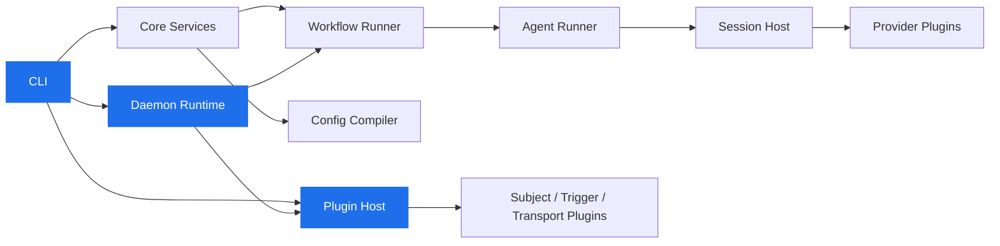

<div align="center">


<br/>

[](https://github.com/launchapp-dev/animus-cli)

<br/>
<br/>

<a href="https://github.com/launchapp-dev/animus-cli/releases/latest"></a>
&nbsp;

&nbsp;

&nbsp;
<a href="https://github.com/launchapp-dev/awesome-ai-coding-tools"></a>

</div>

<p align="center">
<sub>AI agent orchestrator | autonomous coding agents | multi-model AI dev team | Claude + Gemini + GPT workflow automation | MCP integration | YAML-driven CI for AI | Rust CLI</sub>
</p>

<br/>

## Install — 30 seconds

### One paste, any agent

Open a fresh **Claude Code** (or **Codex** / **OpenCode** / **Cursor**) session and paste this. The agent installs the Animus CLI, clones `animus-skills`, runs the setup script, and adds the project section to `CLAUDE.md` / `AGENTS.md`. You'll be running workflows in about a minute.

> Install Animus + Animus Skills: run **`curl -fsSL https://raw.githubusercontent.com/launchapp-dev/animus-cli/main/scripts/install.sh | bash`** to install the `animus` CLI (currently `v0.4.17` in this repo), then **`animus plugin install-defaults --include-subjects --include-transports`** to pull in the provider + subject + transport plugins the daemon needs (one-time setup, idempotent). Then **`git clone --single-branch --depth 1 https://github.com/launchapp-dev/animus-skills.git ~/.claude/skills/animus-skills && cd ~/.claude/skills/animus-skills && ./setup`** to link the skills and write `.mcp.json`. Add an "Animus" section to CLAUDE.md (or AGENTS.md for Codex) listing the slash commands: `/animus-setup`, `/animus-getting-started`, `/animus-mcp-setup`, `/animus-workflow-authoring`, `/animus-pack-authoring`, `/animus-skill-authoring`, `/animus-troubleshooting`. Restart the agent so the new `animus` MCP server is picked up. From a project root, run `/animus-setup` to scaffold `.animus/` and the first workflow.

For Codex CLI, swap the clone path to `~/.codex/skills/animus-skills` and edit `AGENTS.md` instead of `CLAUDE.md`.

### Manual install (no agent)

```bash
curl -fsSL https://raw.githubusercontent.com/launchapp-dev/animus-cli/main/scripts/install.sh | bash
animus plugin install-defaults --include-subjects --include-transports
```

The upstream installer currently targets macOS. On Linux and Windows, use a release archive or build from source.

The second command is **required in v0.4.12 and later** — the daemon no longer ships with bundled providers or subject backends, and will refuse to start until at least one of each is installed. The command is idempotent and skips anything already installed.

<details>
<summary><kbd>options</kbd></summary>

```bash
# Specific version
ANIMUS_VERSION=v0.4.17 curl -fsSL https://raw.githubusercontent.com/launchapp-dev/animus-cli/main/scripts/install.sh | bash

# Custom directory
ANIMUS_INSTALL_DIR=/usr/local/bin curl -fsSL https://raw.githubusercontent.com/launchapp-dev/animus-cli/main/scripts/install.sh | bash

# Run install-defaults automatically as the last step
ANIMUS_INSTALL_PLUGINS=1 curl -fsSL https://raw.githubusercontent.com/launchapp-dev/animus-cli/main/scripts/install.sh | bash

# Skip the post-install plugin step (CI / Docker)
ANIMUS_SKIP_PLUGIN_INSTALL=1 curl -fsSL https://raw.githubusercontent.com/launchapp-dev/animus-cli/main/scripts/install.sh | bash
```

</details>

<details>
<summary><kbd>upgrading from v0.4.11 or earlier</kbd></summary>

Stop the running daemon first, then upgrade. See [`docs/migration/v0.4.11-to-v0.4.12.md`](docs/migration/v0.4.11-to-v0.4.12.md) for the full rationale and rollback procedure.

```bash
animus daemon stop
curl -fsSL https://raw.githubusercontent.com/launchapp-dev/animus-cli/main/scripts/install.sh | bash
animus plugin install-defaults --include-subjects --include-transports
animus daemon preflight                 # verify all required plugins present
animus daemon start --autonomous
```

</details>

<details>
<summary><kbd>prerequisites</kbd></summary>

You need at least one AI coding CLI:

```bash
npm install -g @anthropic-ai/claude-code    # Claude (recommended)
npm install -g @openai/codex                # Codex
npm install -g @google/gemini-cli           # Gemini
```

</details>

---

## What is Animus?

Animus turns a single YAML file into an autonomous software delivery pipeline.

You define agents, wire them into phases, compose phases into workflows, schedule everything with cron — and Animus's daemon handles the rest: dispatching tasks to AI agents in isolated git worktrees, managing quality gates, and merging the results.

Animus is plugin-first. The core daemon is the orchestration runtime; providers, subject backends, triggers, transports, web UI, and log storage ship as independent `animus-*` plugins under [launchapp-dev](https://github.com/launchapp-dev). `animus plugin install <owner/repo>` pulls them in with optional cosign signature verification. The daemon discovers installed plugins at startup, exposes a Unix-socket control protocol, and the CLI, MCP server, and web transports route through that control surface.

```
                ┌──────────────────────────────────────────────────┐
                │            Animus Daemon (Rust)                  │
                │                                                  │
  ┌────────┐    │    ┌───────────┐    ┌───────────┐    ┌────────┐ │    ┌────────┐
  │ Tasks  │───▶│───▶│  Dispatch │───▶│  Agents   │───▶│ Phases │─│──▶│  PRs   │
  │        │    │    │  Queue    │    │           │    │        │ │    │        │
  │ TASK-1 │    │    │ priority  │    │ Claude    │    │ impl   │ │    │ PR #42 │
  │ TASK-2 │    │    │ routing   │    │ Codex     │    │ review │ │    │ PR #43 │
  │ TASK-3 │    │    │ capacity  │    │ Gemini    │    │ test   │ │    │ PR #44 │
  └────────┘    │    └───────────┘    └───────────┘    └────────┘ │    └────────┘
                │                                                  │
                │    Schedules: work-planner (5m), pr-reviewer     │
                │    (5m), reconciler (5m), PO scans (2-8h)        │
                └──────────────────────────────────────────────────┘
```

---

## Quick Start

```bash
cd your-project                                  # any git repo
animus doctor                                    # check prerequisites and auto-remediate
animus init --template task-queue --non-interactive   # scaffold .animus/ from the task-queue template

# v0.4.12 one-time setup: install the provider + subject + transport plugins
# (skip if you already ran this on a previous project — installed plugins
#  live in ~/.animus/plugins/ and are shared across projects):
animus plugin install-defaults --include-subjects --include-transports
animus daemon preflight                          # verify all required plugins are present

# Option 1: run a workflow on demand
animus subject create --kind task --title "Add rate limiting" --priority p1
animus workflow run --task-id TASK-001

# Option 2: go fully autonomous
animus daemon start --autonomous                 # daemon executes ready subjects continuously
animus daemon health                             # verify it's up
animus logs tail --follow                        # stream events as the daemon works

# Scaffold a brand-new subject backend (Jira, Notion, anything with an API):
animus plugin new --kind subject --name jira
```

> **v0.4.12 note:** the daemon will refuse to start unless at least one
> provider plugin and the required subject backends are installed. Run
> `animus daemon preflight` for the exact remediation command if startup
> fails. See [docs/migration/v0.4.11-to-v0.4.12.md](docs/migration/v0.4.11-to-v0.4.12.md)
> for the full upgrade story from v0.4.11.

Bundled `init` templates: **`task-queue`**, **`conductor`**, **`direct-workflow`**.

> **v0.4.4 note:** `animus task ...` and `animus requirements ...` were removed
> in favor of `animus subject --kind <kind>`. Install the task and requirement
> subject plugins, then route through `subject --kind task` or
> `subject --kind requirement`.

---

## Everything in One YAML

<table>
<tr>
<td width="50%">

### Agents

Bind models, tools, MCP servers, and system prompts to named profiles. Route by task complexity.

```yaml
agents:
  default:
    model: claude-sonnet-4-6
    tool: claude
    mcp_servers: ["animus", "context7"]

  work-planner:
    system_prompt: |
      Scan tasks, check dependencies,
      enqueue ready work for the daemon.
    model: claude-sonnet-4-6
    tool: claude
```

</td>
<td width="50%">

### Phases

Reusable execution units. Three modes: **agent** (AI with decision contracts), **command** (shell), **manual** (human gate).

```yaml
phases:
  implementation:
    mode: agent
    agent: default
    directive: "Implement production code."
    decision_contract:
      min_confidence: 0.7
      max_risk: medium

  push-branch:
    mode: command
    command:
      program: git
      args: ["push", "-u", "origin", "HEAD"]
```

</td>
</tr>
<tr>
<td width="50%">

### Workflows

Compose phases into pipelines with skip conditions and post-success hooks.

```yaml
workflows:
  - id: standard
    phases:
      - requirements
      - implementation
      - push-branch
      - create-pr
    post_success:
      merge:
        strategy: squash
        auto_merge: true
        cleanup_worktree: true
```

</td>
<td width="50%">

### Schedules & Triggers

Cron-based autonomous execution and event-driven triggers. Trigger types: `file_watcher`, `webhook` (generic HTTP), `github_webhook` (with event filtering).

```yaml
schedules:
  - id: work-planner
    cron: "*/5 * * * *"
    workflow_ref: work-planner
    enabled: true

triggers:
  - id: pr-opened
    type: github_webhook
    workflow_ref: pr-reviewer
    enabled: true
    config:
      events: ["pull_request"]
```

</td>
</tr>
</table>

---

## The Full Agent Team

Animus doesn't run one agent. It runs an **entire product organization**:

```
  ┌─────────────────────────────────────────────────────────────────┐
  │                                                                 │
  │   Planners               Builders              Reviewers        │
  │   ╭──────────────╮       ╭──────────────╮       ╭──────────────╮│
  │   │ Work Planner │       │ Claude Eng   │       │ PR Reviewer  ││
  │   │ Reconciler   │       │ Codex Eng    │       │ PO Reviewer  ││
  │   │ Triager      │       │ Gemini Eng   │       │ Code Review  ││
  │   │ Req Refiner  │       │ GLM Eng      │       │              ││
  │   ╰──────────────╯       ╰──────────────╯       ╰──────────────╯│
  │                                                                 │
  │   Product Owners         Architects             Operations      │
  │   ╭──────────────╮       ╭──────────────╮       ╭──────────────╮│
  │   │ PO: Web      │       │ Rust Arch    │       │ Sys Monitor  ││
  │   │ PO: MCP      │       │ Infra Arch   │       │ Release Mgr  ││
  │   │ PO: Workflow │       │              │       │ Branch Sync  ││
  │   │ PO: CLI      │       │              │       │ Doc Drift    ││
  │   │ PO: Runner   │       │              │       │ Wf Optimizer ││
  │   ╰──────────────╯       ╰──────────────╯       ╰──────────────╯│
  │                                                                 │
  └─────────────────────────────────────────────────────────────────┘
```

## Key Concepts

<table>
<tr>
<td width="33%">

**Decision Contracts**

Every agent phase returns a typed verdict: `advance`, `rework`, `skip`, or `fail`. Rework loops pass the reviewer's feedback back to the implementer. Configurable `max_rework_attempts` prevents infinite loops.

</td>
<td width="33%">

**Model Routing**

Route tasks to different models by type and complexity. Low-priority bugfixes go to cheap models. Critical architecture tasks go to Opus. The work-planner agent manages this automatically.

</td>
<td width="33%">

**Worktree Isolation**

Every task gets its own git worktree. Agents work in parallel on separate branches without conflicts. Post-success hooks handle merge, cleanup, and PR creation.

</td>
</tr>
</table>

| Complexity | Type | Model | Why |
|:---|:---|:---|:---|
| `low` | bugfix/chore | GLM-5-Turbo | Cheapest option |
| `medium` | feature | Claude Sonnet | Reliable, fast |
| `medium` | UI/UX | Gemini 3.1 Pro | Vision + design expertise |
| `high` | refactor | Codex GPT-5.3 | Strong code understanding |
| `high` | architecture | Claude Opus | Maximum quality |
| `critical` | any | Claude Opus | No compromises |

---

## Plugin Ecosystem

The plugin ecosystem lives in standalone GitHub repositories under
[launchapp-dev](https://github.com/launchapp-dev). The exact `(repo, tag)` set
installed by `animus plugin install-defaults` lives in a single source of truth at
[`crates/orchestrator-core/src/plugin_registry.rs`](crates/orchestrator-core/src/plugin_registry.rs)
so the CLI installer and the daemon preflight always agree on which tag is
"the default":

| Kind | Repos |
|---|---|
| **Protocol + tooling** | [`animus-protocol`](https://github.com/launchapp-dev/animus-protocol), [`animus-plugin-template`](https://github.com/launchapp-dev/animus-plugin-template), [`animus-plugin-registry`](https://github.com/launchapp-dev/animus-plugin-registry) |
| **Subject backends** | `animus-subject-default`, [`animus-subject-requirements`](https://github.com/launchapp-dev/animus-subject-requirements), [`animus-subject-linear`](https://github.com/launchapp-dev/animus-subject-linear), [`animus-subject-sqlite`](https://github.com/launchapp-dev/animus-subject-sqlite), [`animus-subject-markdown`](https://github.com/launchapp-dev/animus-subject-markdown) |
| **Providers** | [`animus-provider-claude`](https://github.com/launchapp-dev/animus-provider-claude), [`animus-provider-codex`](https://github.com/launchapp-dev/animus-provider-codex), [`animus-provider-gemini`](https://github.com/launchapp-dev/animus-provider-gemini), [`animus-provider-opencode`](https://github.com/launchapp-dev/animus-provider-opencode), [`animus-provider-oai`](https://github.com/launchapp-dev/animus-provider-oai) |
| **Triggers** | [`animus-trigger-webhook`](https://github.com/launchapp-dev/animus-trigger-webhook), [`animus-trigger-slack`](https://github.com/launchapp-dev/animus-trigger-slack) |
| **Transports + web UI** | `animus-transport-http`, `animus-transport-graphql`, `animus-web-ui` |
| **Log storage** | [`animus-log-storage-file`](https://github.com/launchapp-dev/animus-log-storage-file) |

```bash
animus plugin install launchapp-dev/animus-provider-claude
animus plugin list                     # see what's installed with SIG column
animus plugin install-defaults --include-subjects --include-transports
animus plugin new my-thing --kind subject   # scaffold from the template
```

Installs verify a sigstore cosign signature when one is published. Use
`--require-signature` to enforce. See
[docs/architecture/plugin-signing.md](docs/architecture/plugin-signing.md).

---

## Claude Code Integration

[**Animus Skills**](https://github.com/launchapp-dev/animus-skills) is the companion skill bundle. Install with the one-paste prompt above, or directly:

```bash
git clone https://github.com/launchapp-dev/animus-skills.git ~/animus-skills
cd ~/animus-skills && ./setup           # auto-detects installed agent hosts
```

The `./setup` script supports `--host claude|codex|opencode|cursor|slate|kiro|all`, `--no-cli` (skip animus install), and `--no-mcp` (skip writing project `.mcp.json`).

<table>
<tr>
<td width="50%">

**Slash Commands**

| Command | What it does |
|:---|:---|
| `/animus-setup` | Initialize Animus in your project |
| `/animus-getting-started` | Install, concepts, first task |
| `/animus-mcp-setup` | Connect AI tools via MCP |
| `/animus-workflow-authoring` | Write custom YAML workflows |
| `/animus-pack-authoring` | Build workflow packs |
| `/animus-skill-authoring` | Author Animus skills |
| `/animus-troubleshooting` | Debug common issues |

</td>
<td width="50%">

**Auto-Loaded References**

| Skill | Coverage |
|:---|:---|
| `animus-configuration` | Config files, state layout, model routing |
| `animus-task-management` | Full task lifecycle via CLI and MCP |
| `animus-daemon-operations` | Daemon monitoring and troubleshooting |
| `animus-queue-management` | Dispatch queue operations |
| `animus-workflow-patterns` | Patterns from 150+ autonomous PRs |
| `animus-agent-personas` | PO, architect, auditor agents |
| `animus-mcp-tools` | Complete `animus.*` tool reference |
| `animus-mcp-servers-for-agents` | Context7, GitHub, memory MCP wiring |

</td>
</tr>
</table>

---

## CLI

```
animus subject       Unified subject surface: list/get/create/update/next/status --kind <kind>
                     (kind=task and kind=requirement are served by installed subject_backend plugins)
animus workflow      Run and manage multi-phase workflows
animus daemon        Start/stop the autonomous scheduler (--autonomous, health, stream)
animus queue         Inspect and manage the dispatch queue
animus agent         Control agent runner processes
animus runner        Inspect and restart the agent runner pool
animus output        Stream and inspect agent output
animus logs          Tail daemon events.jsonl or whichever log-storage plugin is active
animus trigger       Manage event triggers (file_watcher, webhook, github_webhook, slack)
animus pack          Install, list, and update workflow packs
animus plugin        Install, list, inspect, and scaffold stdio plugins
animus skill         Install and inspect Animus skills
animus model         Inspect the model registry and routing
animus project       Per-project config and scope helpers
animus git           Worktree and branch helpers
animus history       Inspect run history (includes phase + runtime error reports)
animus init          Initialize a project from a template registry or local template
animus mcp           Start Animus as an MCP server
animus web           Launch installed web dashboard/transport plugins
animus status        Project overview at a glance
animus doctor        Health checks, auto-remediation, and troubleshooting
```

Run `animus --help` for the full surface.

**Removed in v0.4.4:** `animus task` (→ `animus subject --kind task`),
`animus requirements` (→ `animus subject --kind requirement`),
`animus cloud` (now an out-of-tree plugin), `animus setup`
(→ `animus init`), `animus now` (→ `animus status`),
`animus errors` (→ `animus history`).

---

## Architecture

Animus is a Rust workspace. The core crates:

- `orchestrator-cli` — CLI commands and dispatch
- `orchestrator-core` — services, state, and workflow lifecycle
- `orchestrator-config` — workflow YAML scaffolding, loading, and compilation
- `orchestrator-store` — persistence primitives
- `protocol` — shared types and routing
- `workflow-runner-v2` — workflow execution runtime
- `agent-runner` — LLM CLI process management
- `orchestrator-session-host` — provider plugin session bridge
- `oai-runner` — OpenAI-compatible runner
- `orchestrator-daemon-runtime` — daemon scheduler, cron, event triggers
- `orchestrator-providers` — provider integrations
- `orchestrator-git-ops` — worktree and branch management
- `orchestrator-notifications` — event streaming and notifications
- `orchestrator-logging` — shared logging utilities
- `orchestrator-plugin-host` / `animus-plugin-protocol` / `animus-subject-protocol` / `animus-plugin-runtime` — stdio plugin foundation
- `animus-provider-mock` / `animus-plugin-smoke` — in-tree contract test fixtures for the plugin protocol

See [`docs/architecture/full-system-architecture.md`](docs/architecture/full-system-architecture.md),
[`docs/architecture/runtime-architecture.md`](docs/architecture/runtime-architecture.md),
and [`docs/architecture/plugin-system.md`](docs/architecture/plugin-system.md)
for the current source-backed architecture docs.

The web dashboard is no longer bundled in-tree. Install it as plugins via
`animus plugin install-defaults --include-transports`
(`animus-transport-http` + `animus-transport-graphql` + `animus-web-ui`).



---

## Platforms

| Platform | Architecture | |
|:---|:---|:---|
| macOS | Apple Silicon (M1+) | `aarch64-apple-darwin` |
| macOS | Intel | `x86_64-apple-darwin` |
| Linux | x86_64 | `x86_64-unknown-linux-gnu` |
| Linux | arm64 | `aarch64-unknown-linux-gnu` |
| Windows | x86_64 | `x86_64-pc-windows-msvc` |

---

## License

This project is licensed under the [Elastic License 2.0 (ELv2)](LICENSE). You may use, modify, and distribute the software, but you may not provide it to third parties as a hosted or managed service.

---

<div align="center">

**Update**

```bash
curl -fsSL https://raw.githubusercontent.com/launchapp-dev/animus-cli/main/scripts/install.sh | bash
```

**Uninstall**

```bash
rm -f ~/.local/bin/animus \
  ~/.local/bin/agent-runner \
  ~/.local/bin/animus-oai-runner \
  ~/.local/bin/animus-workflow-runner \
  ~/.local/bin/ao-workflow-runner
```

<br/>

<sub>Built with Rust. Powered by AI. Ships code autonomously.</sub>

</div>


