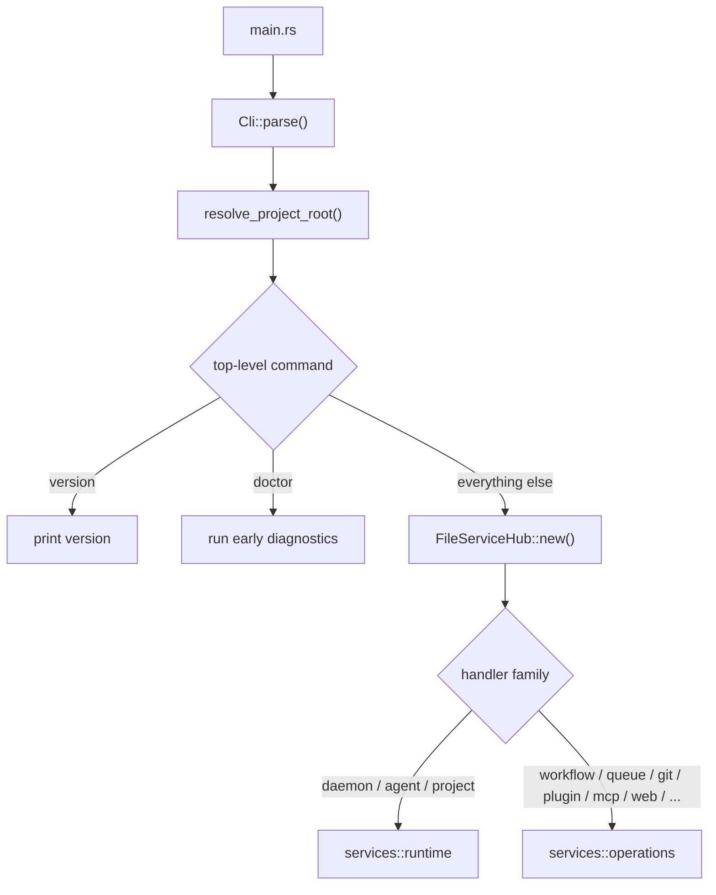
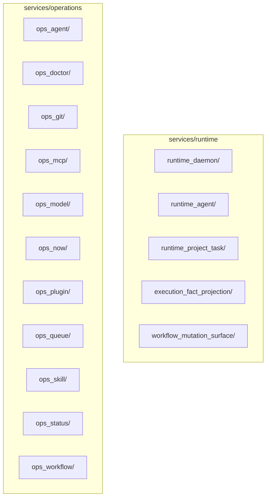

# orchestrator-cli

The main `animus` binary and the primary user-facing CLI surface for the workspace.

## Overview

Every `animus` invocation flows through this crate. It parses the command line,
resolves the project root, constructs a `FileServiceHub` when needed, and then
dispatches into either runtime control flows or operation handlers. It also owns
the CLI-facing `animus.cli.v1` JSON envelope used by `--json`.

## Target

- Binary: `animus`

## Startup flow

## Current layout

### CLI types

`src/cli_types/` contains the Clap-derived command tree. The live top-level
surface is defined by:

- `root_types.rs`
- `agent_types.rs`
- `daemon_types.rs`
- `doctor_types.rs`
- `git_types.rs`
- `history_types.rs`
- `init_types.rs`
- `logs_types.rs`
- `mcp_types.rs`
- `model_types.rs`
- `output_types.rs`
- `pack_types.rs`
- `plugin_types.rs`
- `project_types.rs`
- `queue_types.rs`
- `runner_types.rs`
- `skill_types.rs`
- `subject_types.rs`
- `trigger_types.rs`
- `web_types.rs`
- `workflow_types.rs`

### Services

## Top-level commands

The current command families are:

- `version`
- `daemon`
- `agent`
- `project`
- `queue`
- `workflow`
- `history`
- `git`
- `skill`
- `model`
- `pack`
- `plugin`
- `runner`
- `status`
- `output`
- `mcp`
- `web`
- `init`
- `doctor`
- `trigger`
- `logs`
- `subject`

See [`docs/reference/cli/index.md`](../../docs/reference/cli/index.md) for the
full tree and selected flags.

## Key files

- `src/shared/output.rs`: success/error printing and JSON envelope formatting
- `src/shared/cli_error.rs`: exit-code mapping and error classification
- `src/shared/parsing.rs`: argument normalization and validation helpers
- `src/services/runtime/`: daemon, agent, and project-runtime control paths
- `src/services/operations/`: command handlers for workflow, git, plugin, MCP,
  output, queue, status, and related operations

## Notes

- `doctor` can run without constructing a `FileServiceHub`.
- `animus web` launches external `transport_backend` and `web_ui` plugins; the
  web stack is not in-tree.
