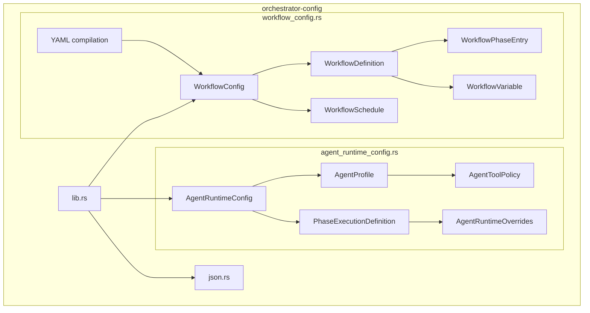
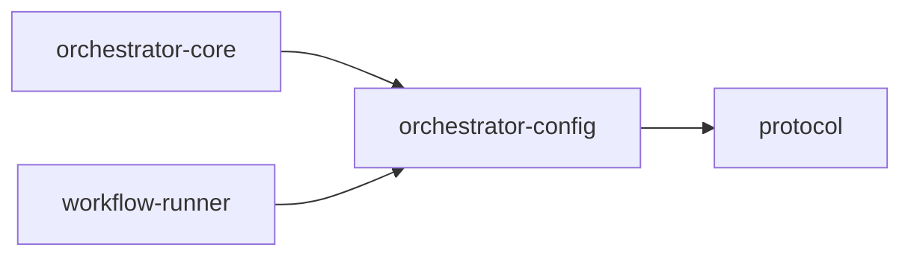

# orchestrator-config

Centralized configuration loading, validation, and compilation for Animus runtime and workflow config.

## Overview

`orchestrator-config` is the schema and file-management crate for Animus
configuration. It owns two core config domains:

- `agent-runtime-config.v2.json`
- `workflow-config.v2.json`

Those schema ids remain the normalized internal config shapes, but the live
project authoring surface is YAML under `.animus/workflows.yaml` and
`.animus/workflows/`. Legacy repo-scoped JSON workflow/runtime config files are
no longer the supported source of truth.

## Targets

- Library: `orchestrator_config`

## Architecture

## Key components

### Agent runtime config

`src/agent_runtime_config.rs` defines:

- agent profiles
- phase execution definitions
- tool/model overrides
- MCP server bindings
- retry and backoff configuration
- output and decision contracts

It also provides the load, ensure, hash, and write helpers for the resolved v2
runtime config model, sourced from workflow YAML or the built-in fallback.

### Workflow config

`src/workflow_config.rs` defines:

- workflow definitions and phase catalogs
- verdict routing and skip guards
- workflow variables
- post-success merge config
- integrations and daemon config
- workflow schedules
- YAML compilation and validation helpers

### JSON persistence

`src/json.rs` provides the pretty JSON writer used by the config load/write helpers.

## File conventions

- Workflow and agent runtime authoring lives in `.animus/workflows.yaml` and
  `.animus/workflows/*.yaml`.
- `load_workflow_config_with_metadata()` resolves from workflow YAML, installed
  packs, and built-in defaults.
- `load_agent_runtime_config_with_metadata()` resolves runtime config from the
  same workflow YAML surface and falls back to the built-in compiled config when
  needed.
- Legacy repo-scoped JSON config files such as `state/workflow-config.v2.json`
  are no longer the supported live config path.

## Workspace dependencies

## Notes

- This crate validates and compiles config. It does not execute workflows or agents itself.
- `orchestrator-core` and `workflow-runner` are its primary downstream consumers.
