# Architecture Diagram

High-level runtime topology of an Animus install. This diagram is the
fastest way to orient a new operator or plugin author. For the
full narrative see
[`docs/architecture/full-system-architecture.md`](full-system-architecture.md);
for the crate-level dependency graph see
[`docs/architecture/index.md`](index.md); for the inbound control
surface in detail see
[`docs/architecture/control-protocol.md`](control-protocol.md); for the
outbound plugin contracts see
[`docs/architecture/subject-backend-plugins.md`](subject-backend-plugins.md)
and the companion `*-plugins.md` series.

---

## Runtime topology

```mermaid
flowchart TB
    classDef user fill:#1f6feb,stroke:#0d1117,color:#f0f6fc;
    classDef daemon fill:#161b22,stroke:#1f6feb,color:#f0f6fc;
    classDef plugin fill:#21262d,stroke:#3fb950,color:#f0f6fc;
    classDef external fill:#21262d,stroke:#d29922,color:#f0f6fc;
    classDef state fill:#0d1117,stroke:#8b949e,color:#f0f6fc;

    %% ---- Users ----
    subgraph Users["Operators"]
        direction LR
        CLI["animus CLI"]:::user
        MCP["MCP tool callers<br/>(Claude Code, Codex, ...)"]:::user
        BROWSER["Web browser"]:::user
    end

    %% ---- Transport plugins ----
    subgraph Transports["Transport plugins (out-of-process)"]
        direction TB
        HTTP["animus-transport-http"]:::plugin
        GQL["animus-transport-graphql"]:::plugin
        WEBUI["animus-web-ui<br/>(React 18 + Tailwind 4)"]:::plugin
    end

    %% ---- Daemon ----
    subgraph Daemon["animus daemon (orchestrator-cli binary)"]
        direction TB
        CTRL["Control RPC server<br/>(Unix socket: ~/.animus/scope/control.sock)<br/>NDJSON JSON-RPC"]:::daemon
        ROUTER["Subject router"]:::daemon
        SCHED["Scheduler / workflow dispatch"]:::daemon
        WR["workflow-runner-v2"]:::daemon
        PHOST["Plugin host<br/>(orchestrator-plugin-host<br/>+ orchestrator-session-host)"]:::daemon
        BCAST["Notification broadcaster<br/>(WorkflowEvent / AgentNotification)"]:::daemon
    end

    %% ---- Plugin processes ----
    subgraph Subjects["Subject plugins (out-of-process)"]
        direction TB
        SD["animus-subject-default<br/>(task subjects)"]:::plugin
        SR["animus-subject-requirements"]:::plugin
        SL["animus-subject-linear"]:::plugin
        SQL["animus-subject-sqlite"]:::plugin
        SMD["animus-subject-markdown"]:::plugin
    end

    subgraph Providers["Provider plugins (out-of-process)"]
        direction TB
        PC["animus-provider-claude"]:::plugin
        PCO["animus-provider-codex"]:::plugin
        PG["animus-provider-gemini"]:::plugin
        POC["animus-provider-opencode"]:::plugin
        POA["animus-provider-oai<br/>(+ oai-agent)"]:::plugin
    end

    subgraph Triggers["Trigger plugins (out-of-process)"]
        direction TB
        TW["animus-trigger-webhook"]:::plugin
        TS["animus-trigger-slack"]:::plugin
    end

    %% ---- External systems ----
    subgraph External["External systems"]
        direction TB
        EXT_CLAUDE["claude / codex / gemini /<br/>opencode / OpenAI APIs"]:::external
        EXT_LINEAR["Linear / GitHub Issues /<br/>filesystem / SQLite"]:::external
        EXT_SLACK["Slack / inbound webhooks"]:::external
    end

    %% ---- State ----
    STATE["~/.animus/&lt;repo-scope&gt;/<br/>state/, daemon/, worktrees/<br/>+ .animus/ project config"]:::state

    %% ---- Edges ----
    CLI -->|spawns CLI process,<br/>connects control.sock| CTRL
    MCP -->|spawns CLI via MCP tool,<br/>connects control.sock| CTRL
    BROWSER -->|HTTP / WebSocket| HTTP
    BROWSER -->|GraphQL / SSE| GQL
    BROWSER -->|static assets| WEBUI

    HTTP -->|control RPC over Unix socket| CTRL
    GQL -->|control RPC over Unix socket| CTRL
    WEBUI -->|control RPC over Unix socket| CTRL

    CTRL --> ROUTER
    CTRL --> SCHED
    SCHED --> WR
    SCHED -->|reads state| STATE
    WR -->|emits WorkflowEvent| BCAST
    ROUTER -->|spawns / routes| PHOST

    PHOST -->|stdio JSON-RPC<br/>subject/list, subject/update| SD
    PHOST -->|stdio JSON-RPC| SR
    PHOST -->|stdio JSON-RPC| SL
    PHOST -->|stdio JSON-RPC| SQL
    PHOST -->|stdio JSON-RPC| SMD

    WR -->|stdio JSON-RPC<br/>agent/run, agent/cancel| PC
    WR -->|stdio JSON-RPC| PCO
    WR -->|stdio JSON-RPC| PG
    WR -->|stdio JSON-RPC| POC
    WR -->|stdio JSON-RPC| POA

    PHOST -->|stdio JSON-RPC<br/>trigger/watch| TW
    PHOST -->|stdio JSON-RPC| TS

    SD -->|files| STATE
    SR -->|files| STATE
    SL -->|HTTPS| EXT_LINEAR
    SQL -->|local file| EXT_LINEAR
    SMD -->|local files| EXT_LINEAR

    PC -->|spawns CLI subprocess| EXT_CLAUDE
    PCO -->|spawns CLI subprocess| EXT_CLAUDE
    PG -->|spawns CLI subprocess| EXT_CLAUDE
    POC -->|spawns CLI subprocess| EXT_CLAUDE
    POA -->|HTTPS / API| EXT_CLAUDE

    TW -->|HTTP listener| EXT_SLACK
    TS -->|WebSocket / HTTP| EXT_SLACK
    TW -->|trigger/event| PHOST
    TS -->|trigger/event| PHOST

    PC -->|AgentNotification:<br/>TextDelta / Thinking /<br/>ToolCall / ToolResult| BCAST
    PCO --> BCAST
    PG --> BCAST
    POC --> BCAST
    POA --> BCAST

    BCAST -->|broadcast: control subscribers| CTRL
```

---

## How to read it

- **Blue** nodes are operators or the CLI surface they invoke.
- **Charcoal-with-blue-border** nodes are inside the long-lived
  `animus daemon` process.
- **Charcoal-with-green-border** nodes are plugin processes the daemon
  spawns and supervises.
- **Charcoal-with-amber-border** nodes are external systems plugins
  talk to.
- **Dark** nodes are on-disk state.

Arrows point in the direction of the call. JSON-RPC over stdio is the
contract for every plugin edge. The Unix socket is the contract for
every operator-facing edge into the daemon.

---

## Design rationale

### Why plugin-first

Animus deletes its own bundled providers, subject backends, and web
stack as of v0.4.12. The reasoning is:

- **Vendoring rots.** A bundled claude integration drifts behind the
  upstream CLI's release cadence. A plugin pinned to a specific
  upstream version is the customer's choice and the plugin author's
  responsibility.
- **One contract.** When the in-tree `task` backend, the in-tree
  Linear adapter, and a third-party Jira plugin all satisfy
  `SubjectBackend`, the daemon stops needing per-backend code paths.
- **Replaceable parts.** A bug in `animus-provider-claude` doesn't
  require a daemon release. Pin to the previous plugin tag, fix
  forward at your own cadence.

### Why stdio

JSON-RPC over stdin/stdout is the lowest-common-denominator
inter-process contract:

- No port allocation, no auth, no TLS, no service discovery.
- Works on every platform Animus targets without conditionals.
- Plugin authors can write in any language that can read a line and
  write a line.
- The daemon supervises the process directly (signals, exit codes,
  stderr capture, restart budget).

### Why Unix socket for control

The operator-facing inbound surface uses a Unix domain socket at
`~/.animus/<scope>/control.sock`:

- **No port to claim.** Two projects on the same machine don't
  collide.
- **Filesystem-scoped auth.** Unix permissions on the socket file
  decide who can connect — no per-call token negotiation.
- **Cheap connect.** CLI invocations connect, send one request, exit.
  The daemon doesn't pay TLS handshake costs per command.

Transport plugins (`animus-transport-http`, `animus-transport-graphql`)
bridge to network-addressable transports when they're needed. The
core daemon never opens a port itself.

### Why streaming notifications

Three flows are inherently streaming:

- `agent/run` token output (`TextDelta`, `Thinking`, `ToolCall`,
  `ToolResult`).
- `WorkflowEvent` fan-out to the web UI (workflow started, phase
  completed, decision needed).
- `subject/changed` and `trigger/event` push from external systems.

JSON-RPC notifications (id-less frames) carry all three. The plugin
host's reader task routes responses to per-call `oneshot::Sender`s and
notifications to a `broadcast::Sender` so any number of subscribers
fan out from one process. Channel capacity defaults to 256; plugins
that emit bursts declare `notification_buffer_size` in their manifest.
See
[`docs/architecture/plugin-host-concurrency.md`](plugin-host-concurrency.md)
for the full contract.

### How durability works

- **Phase sessions** persist as `<phase>.session.json` under
  `~/.animus/<scope>/runs/<run-id>/`. On daemon restart the scheduler
  attempts `provider.resume_agent` against the originating plugin.
- **Idempotency annotations** on workflow phases gate auto-resume.
  `idempotent` retries silently; `sideeffecting` and `unknown` block
  with an actionable hint so the operator decides. See the v0.4.12
  CHANGELOG entry and
  [`docs/migration/v0.4.11-to-v0.4.12.md`](../migration/v0.4.11-to-v0.4.12.md).
- **Event log** ships to `events.jsonl` under the scoped state root
  via the in-tree `orchestrator-logging` fallback, or to whichever
  `log_storage_backend` plugin is installed.
- **Plugin restart budgets** (5 attempts under exponential backoff)
  cap the blast radius of a flaky plugin without taking the daemon
  down with it.

### Known gaps

- **Subprocess workflow runner events.** Workflow events emitted by
  workflow runners spawned as subprocesses are not yet plumbed through
  the long-lived plugin host to control subscribers. Single-process
  workflows stream fine; the subprocess path is tracked for v0.5. See
  [`docs/architecture/plugin-host-concurrency.md`](plugin-host-concurrency.md).
- **Provider supervisor.** The trigger supervisor's
  exponential-backoff restart loop has not yet been generalized to
  providers. Provider crashes return `ConnectionLost` to the caller
  today; the long-lived provider host + supervisor migration is also
  v0.5.
- **`agent/cancel` routing.** Cancel today spawns a fresh plugin
  process that doesn't know about the live session. The fix lands
  with the long-lived host migration; until then cancel against a
  long-running stream is best-effort.

---

## Related docs

- [Crate Map](crate-map.md) — workspace-level layout
- [Control Protocol](control-protocol.md) — inbound RPC contract
- [Plugin Host Concurrency](plugin-host-concurrency.md) — reader/router model + cancel
- [Subject Backend Plugins](subject-backend-plugins.md) — outbound subject contract
- [Plugin Signing](plugin-signing.md) — cosign policy
- [Naming Contract](naming-contract.md) — `animus.*` everywhere
- [Plugin Author Guide](../guides/plugin-author-guide.md) — write your own
- [Operator Runbook](../guides/operator-runbook.md) — run it in production
