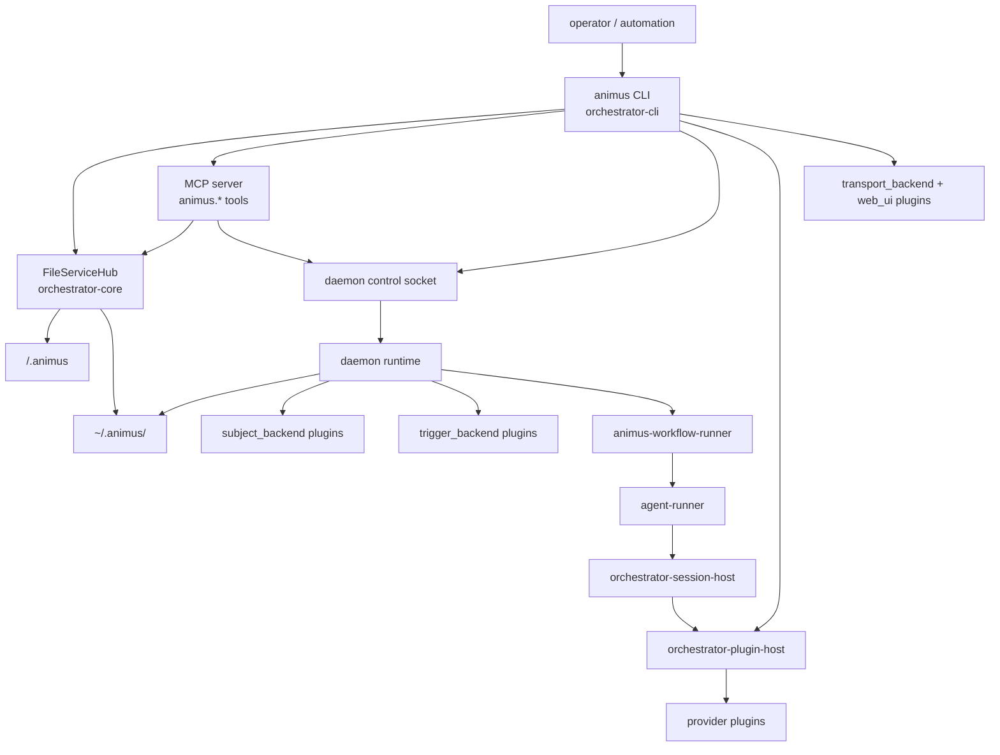
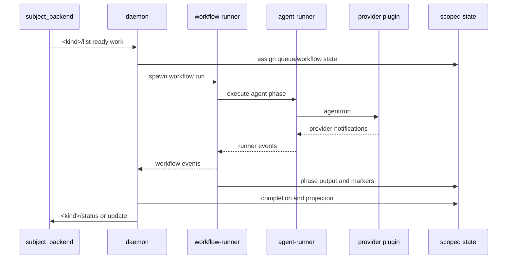

# Full System Architecture

This is the canonical architecture narrative for the current Animus workspace.
It ties together the crate map, runtime process model, state layout, daemon,
workflow runner, agent runner, plugin system, control surfaces, and operational
boundaries.

If this document and code disagree, trust the code. The fastest source checks
are `Cargo.toml`, `crates/orchestrator-cli/src/cli_types/root_types.rs`,
`crates/orchestrator-core/src/config.rs`, `crates/orchestrator-core/src/services.rs`,
`crates/orchestrator-daemon-runtime/src/lib.rs`, and
`crates/workflow-runner-v2/src/lib.rs`.

## Architecture Goals

Animus is a Rust-only orchestration kernel for autonomous software delivery. The
kernel coordinates work, state, workflows, subprocesses, and plugins. It does
not embed a desktop shell, browser runtime, provider SDK, or system-of-record
implementation into daemon-core.

The core goals are:

- one CLI and MCP surface over the same service and control primitives
- repo-scoped runtime state that works across linked worktrees
- workflow execution as the central unit of automation
- installed plugins for providers, subjects, triggers, transports, and web UI
- daemon scheduling that stays dumb: queue, capacity, supervision, events
- source-backed documentation that does not preserve removed crates or old
  command trees as current architecture

## Workspace Inventory

`Cargo.toml` currently declares 18 workspace members.

| Group | Crates |
|---|---|
| CLI | `orchestrator-cli` |
| Core services | `orchestrator-core`, `orchestrator-config`, `orchestrator-store` |
| Runtime | `orchestrator-daemon-runtime`, `workflow-runner-v2`, `agent-runner` |
| Provider/session | `orchestrator-session-host`, `orchestrator-providers`, `oai-runner` |
| Plugin foundation | `orchestrator-plugin-host`, `animus-plugin-protocol`, `animus-subject-protocol`, `animus-plugin-runtime` |
| Support | `orchestrator-git-ops`, `orchestrator-notifications`, `orchestrator-logging`, `protocol` |

Repo-local but not current workspace members: `animus-provider-mock`,
`animus-plugin-smoke`, and `orchestrator-web-server`.

The release/runtime binary set is:

| Binary | Package | Role |
|---|---|---|
| `animus` | `orchestrator-cli` | User-facing CLI, MCP endpoint, operations |
| `agent-runner` | `agent-runner` | Agent execution service |
| `animus-oai-runner` | `oai-runner` | OpenAI-compatible runner |
| `animus-workflow-runner` | `workflow-runner-v2` | Workflow phase execution runner (v0.4.x `ao-workflow-runner` retained as installer-created back-compat symlink) |

## Process Topology



The daemon and CLI may both instantiate service hubs. When the daemon is
running, control-aware operations prefer the daemon control socket so external
surfaces see the live runtime view. Direct service operations still exist for
commands that are local, bootstrap-oriented, or intentionally one-shot.

## Startup and Root Resolution

Every command starts in `orchestrator-cli`:

1. Parse global flags and the selected command.
2. Resolve project root:
   - `--project-root`
   - Git common root for the current directory or linked worktree
   - current working directory
3. Bootstrap project-local `.animus/` files if needed.
4. Resolve repository scope and scoped runtime paths.
5. Construct `FileServiceHub`.
6. Dispatch into command operation, daemon runtime, MCP service, plugin host, or
   web plugin launcher.

Project root behavior is owned by `orchestrator-core/src/config.rs`. Bootstrap
and state persistence are owned by `orchestrator-core/src/services.rs` and
`orchestrator-store`.

## State and Configuration

Animus splits state into three levels.

Project-local config in `<project>/.animus/`:

- `config.json`
- `workflows.yaml`
- `workflows/*.yaml`
- `plugins.lock`

Scoped runtime state in `~/.animus/<repo-scope>/`:

- `core-state.json`
- `resume-config.json`
- `workflow.db`
- `config/`
- `daemon/`
- `docs/`
- `state/`
- `worktrees/`

Global state in `protocol::Config::global_config_dir()`:

- global `config.json`
- credentials
- daemon event files
- CLI tracker state
- plugin registry
- runner socket and runner config files

`<repo-scope>` is `<sanitized-repo-name>-<12 hex sha256(canonical-root)>`.
The scope is what lets multiple repositories or linked worktrees avoid sharing
runtime state by accident.

## Configuration Loading

Workflow and runtime configuration flow through `orchestrator-config` and
`protocol`:

- project config is local to `.animus/config.json`
- workflow overlays come from `.animus/workflows.yaml` and
  `.animus/workflows/*.yaml`
- packs and templates can contribute workflow definitions and runtime overlays
- compiled runtime state is written under the repo-scoped runtime directory

New architecture should not introduce separate ad hoc config roots. If a setting
changes workflow behavior, it belongs in workflow config or pack/runtime config.
If it changes runtime state, it belongs under the scoped state root.

## ServiceHub Boundary

`FileServiceHub` is the service composition root for file-backed operations. The
`ServiceHub` trait exposes service APIs for:

- daemon lifecycle and health
- projects
- tasks and task provider compatibility
- subject resolution
- workflows
- planning and requirements
- reviews

The service layer owns domain mutations and persistence. CLI/MCP/control
handlers should route through services or explicit daemon control adapters
instead of mutating generated JSON by hand.

## Domain Model

Animus currently has these main domain concepts:

| Concept | Meaning | Primary owner |
|---|---|---|
| Subject | Generic unit of dispatchable work, routed by kind | subject backend plugins, `animus-subject-protocol` |
| Task | Default subject kind for local task work | `animus-subject-default` plugin and compatibility services |
| Requirement | Requirement subject and planning unit | requirements plugin and planning services |
| Workflow | Multi-phase automation plan | `orchestrator-core`, `workflow-runner-v2` |
| Phase | One step in a workflow, command or agent backed | `workflow-runner-v2` |
| Queue entry | Pending/held/assigned dispatch unit | `orchestrator-daemon-runtime::queue` |
| Trigger | Event source that can enqueue or dispatch work | trigger plugins and daemon schedule runtime |
| Execution fact | Runtime fact emitted by workflow execution | `protocol`, execution projection |

The long-term architecture is subject-first. Removed command trees such as
`animus task` and `animus requirements` should not reappear as privileged runtime
paths.

## CLI, MCP, Control, and Web Surfaces

| Surface | Entry | Architecture |
|---|---|---|
| CLI | `animus <command>` | clap types in `orchestrator-cli`, operation modules in `services/operations` |
| MCP | `animus mcp` | exposes `animus.*` tools over the same command/service/control logic |
| Daemon control | Unix socket | JSON-RPC control protocol, routed by `orchestrator-daemon-runtime::control` |
| Web | `animus web` | launches installed `transport_backend` and `web_ui` plugins |
| Plugin call | `animus plugin call` | one-shot stdio plugin host request |

The web stack is outside this workspace. `animus web` discovers transport and UI
plugins, starts them, and opens the advertised UI URL. There is no in-tree web
server or bundled React app.

## Daemon Runtime

`orchestrator-daemon-runtime` owns runtime coordination. Its public module set
documents the split:

- `daemon`: runtime loop, event log, run guard, preflight wiring
- `queue`: dispatch queue state and operations
- `dispatch`: ready-work planning, process manager, workflow runner command
  construction, completion reconciliation
- `tick`: project tick preparation, execution, summaries, and hooks
- `schedule`: cron and trigger dispatch
- `control`: daemon control socket server/client/routing/streaming
- `subject_dispatch`: subject backend plugin resolution and routing
- `log_storage`: log storage plugin dispatch
- `metrics`, `quotas`, `audit`: operational support

The daemon starts autonomous work only after plugin preflight passes unless the
operator explicitly skips preflight. Default preflight requires:

- at least one provider plugin
- a `task` subject backend
- a `requirement` subject backend

## Dispatch Loop

The high-level daemon loop is:

1. Load project and daemon configuration.
2. Reconcile active workflow processes and stale workflow state.
3. Resolve queue and subject state.
4. Apply capacity limits and schedule headroom.
5. Build a ready dispatch plan.
6. Spawn `animus-workflow-runner` processes for selected work.
7. Process due triggers when capacity allows.
8. Capture workflow events, completion, and terminal projection.
9. Persist metrics, logs, and queue state.

The process manager owns active workflow children. Workflow execution details
stay in `workflow-runner-v2`.

## Workflow Runner

`workflow-runner-v2` is the execution host for workflow phases. Its module split
is architectural:

- `workflow_execute`: top-level workflow execution
- `phase_executor`: phase execution orchestration
- `phase_command`: external command phases
- `phase_session`: agent/provider backed phases
- `phase_prompt`: prompt rendering
- `phase_output`: phase output persistence and completion markers
- `phase_git`: git identity, commits, pending-change checks
- `phase_failover`: failure classification
- `workflow_event_emitter`: event pipe back to daemon/control surfaces
- `runtime_contract`: runtime contract injection, including MCP support
- `skill_dispatch`: skill-aware phase dispatch
- `ensure_execution_cwd`: cwd safety for execution

Workflow phases emit events and persisted output. Terminal phase state projects
back into workflow state and, where configured, subject state.

## Agent Runner

`agent-runner` owns agent execution service concerns:

- IPC server, auth, routing, and status/control handlers
- run lifecycle and cleanup
- workspace guard
- environment sanitizer
- process/session setup
- stdout/stderr stream bridging
- provider output parsing
- event persistence
- telemetry

Provider-specific session behavior is not implemented directly in daemon-core.
The runner delegates provider sessions through `orchestrator-session-host`.

## Provider Session Host

`orchestrator-session-host` resolves installed provider plugins and adapts them
to the external `animus-session-backend` contract. It owns:

- provider plugin discovery
- reserved provider name handling
- `oai-runner` and `animus-oai-runner` alias normalization to `oai`
- `agent/run`, `agent/resume`, and `agent/cancel`
- active session host retention for cancel
- death-like failure retry policy
- provider restart supervision and cooldown

There is no in-tree provider fallback. Missing providers return install
instructions.

## Plugin System

Plugins are standalone executables. The shared host contract is:

1. Discover candidate binaries or registry entries.
2. Probe `--manifest` with hardened IO limits.
3. Spawn with a cleared environment.
4. Send `initialize`.
5. Route JSON-RPC requests and notifications over stdin/stdout.

Plugin kinds:

- `provider`
- `subject_backend`
- `trigger_backend`
- `transport_backend`
- `web_ui`
- `log_storage_backend`
- `custom`
- legacy `task_backend`

The full contract is documented in [Plugin System](plugin-system.md).

## Subject Architecture

Subject backends are plugins. The control surface uses generic subject verbs,
but plugin calls are kind-scoped:

- `task/list`
- `task/get`
- `requirement/list`
- `linear.issue/update`
- and so on

`SubjectRouter` maps `capabilities.subject_kinds` to plugin hosts. Exact kind
claims win over globs; longest glob wins; duplicate exact or duplicate glob
prefix claims fail setup.

See [Subject Backend Plugins](subject-backend-plugins.md).

## Trigger, Schedule, and Queue Architecture

Triggers and schedules feed the dispatch queue or start workflow dispatch when
capacity allows.

- Trigger plugins watch external systems and emit `trigger/event`.
- The daemon acknowledges accepted trigger events with `trigger/ack`.
- Queue state tracks pending, held, assigned, and terminal dispatch entries.
- Tick planning combines queue state, subject readiness, daemon capacity, and
  schedule headroom.

The daemon owns when work starts. Plugins own how external events are observed.

## Git and Worktree Architecture

`orchestrator-git-ops` owns git automation helpers. Runtime worktree state lives
under `~/.animus/<repo-scope>/worktrees/`.

Workflow and daemon code should treat git operations as explicit boundary calls:

- create or use managed worktrees
- ensure git identity for commits
- detect pending changes
- commit implementation changes when phase policy requires it
- recover or surface merge conflicts instead of hiding them

Architecture changes must not add implicit destructive git cleanup.

## Observability and Output

Observability spans several layers:

- daemon event log and health snapshots
- daemon control streaming
- workflow event pipe from `workflow-runner-v2`
- runner event persistence
- output inspection via `animus output`
- history inspection via `animus history`
- logs via in-tree log files or `log_storage_backend` plugins
- audit events for security-sensitive operations such as plugin installs

Operational logs and output are runtime state. They should not be written into
project-local config unless the user explicitly exports or commits an artifact.

## Security Boundaries

Important security and safety boundaries:

- workspace is Rust-only
- no bundled desktop shell frameworks
- plugin processes run out of process
- plugin environments are scrubbed
- install lockfiles preserve approved plugin hashes
- cosign keyless verification is supported for release installs
- first-party provider names are reserved
- subject ids are opaque backend-qualified strings
- command phases execute external binaries explicitly
- agent workspaces are guarded by project root or managed worktree policy

See [Plugin Signing](plugin-signing.md) and [Plugin Host Concurrency](plugin-host-concurrency.md).

## Concurrency Model

| Area | Model |
|---|---|
| Daemon | tick loop plus child process supervision |
| Workflow runner | phase execution with explicit event emission and persisted markers |
| Agent runner | IPC server with live/finished run maps |
| Plugin host | single stdout reader task, pending response map, notification broadcast |
| Provider sessions | active session map so cancel reaches the owning plugin host |
| State writes | file-backed services and atomic store helpers |

Avoid adding cross-cutting locks around async request paths. Prefer immutable
routing maps, scoped ownership, channels, and explicit child-process boundaries.

## Extension Points

Preferred extension points:

- add a plugin kind or plugin method when behavior belongs outside daemon-core
- add a workflow pack when behavior is domain/workflow-specific
- add a CLI/MCP/control adapter when exposing an existing service capability
- add a service API method when a domain mutation needs one authoritative path
- add a workflow phase/runtime contract when execution semantics change

Avoid:

- hand-editing generated state JSON
- adding hidden fallback state locations for new features
- duplicating CLI, MCP, and control mutations separately
- embedding provider-specific behavior in daemon-core
- reintroducing removed command trees as privileged architecture

## End-to-End Data Lifecycle



## Architectural Invariants

- `Cargo.toml` is the source of truth for workspace membership.
- CLI surface docs must follow `root_types.rs` and generated reference docs.
- MCP docs must follow the actual operation modules and tool registry.
- Plugin defaults must follow `orchestrator-core::plugin_registry`.
- State layout must follow `protocol` and `orchestrator-store`.
- Web behavior is plugin-hosted, not bundled.
- Provider execution is plugin-hosted, not in-tree fallback.
- Subject execution is kind-routed through plugins.
- Runtime-critical binaries must keep compiling together.

## Verification Checklist

Use this checklist for architecture-affecting changes:

```bash
cargo animus-bin-check
cargo test -p orchestrator-cli
cargo test -p orchestrator-daemon-runtime
cargo test -p workflow-runner-v2
cargo test -p agent-runner
cargo test -p orchestrator-plugin-host
cargo test -p orchestrator-session-host
```

For docs-only architecture changes, at minimum run:

```bash
cargo animus-bin-check
git diff --check
```

Then search for stale references to removed architecture:

```bash
rg 'llm-cli-wrapper|embedded web|in-tree task|14 repos|Latest:' README.md docs crates
```
