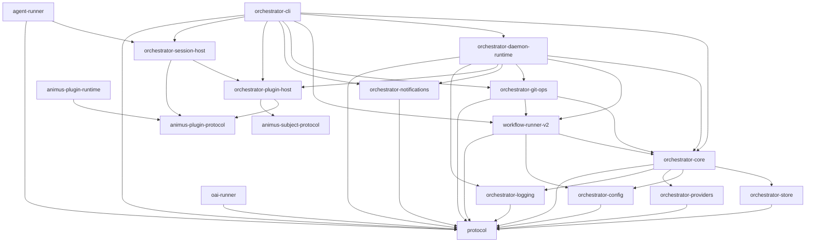

# Architecture Overview

Animus is a Rust-only agent orchestrator built as a Cargo workspace of 18 crates.
It provides the `animus` CLI, daemon runtime, workflow runner, agent runner, MCP
server, plugin host, and plugin protocol crates. Provider, subject, transport,
and web UI integrations run as external stdio plugins rather than in-process
desktop or web shell frameworks.

Trust code and generated references over hand-maintained summaries when they
disagree. Start with:

- [Full System Architecture](full-system-architecture.md)
- [Runtime Architecture](runtime-architecture.md)
- [Plugin System](plugin-system.md)
- [Crate Map](crate-map.md)
- [Runtime Topology Diagram](diagram.md)

## Crate Dependency Graph

`protocol` sits at the foundation for shared types, configuration shapes, and
runtime path derivation.

`orchestrator-core` provides the domain services and state mutation APIs used by
the CLI, daemon, and plugin preflight paths.

`orchestrator-cli` composes the workspace into the user-facing `animus` command
surface.

## Architecture Decision Records

- [Kernel and Flavors](kernel-and-flavors.md) -- **v0.5 product architecture commitment.** Animus is a kernel + a default flavor (curated plugin bundle) for portfolio builders. Future flavors emerge from real customer pull, not roadmap speculation. Read this before adding scope.
- [Naming Contract](naming-contract.md) -- One name everywhere: `animus.*` for MCP tools, env vars, config dirs, pack ids, and JSON envelopes
- [Full System Architecture](full-system-architecture.md) -- Canonical end-to-end architecture narrative covering crates, process topology, state, config, services, daemon, workflow runner, agent runner, plugins, control surfaces, security, observability, and verification
- [Runtime Architecture](runtime-architecture.md) -- Current end-to-end runtime topology, startup flow, state model, crate responsibilities, execution pipeline, and failure boundaries
- [Plugin System](plugin-system.md) -- Current stdio plugin architecture: discovery, install state, wire protocol, hosting, security, provider/subject/trigger/transport paths, and operations
- [Plugin Pack Kernel](plugin-pack-kernel.md) -- Package-style plugin architecture for workflows, MCP servers, and bundled domain modules
- [Project Init Templates](project-init-templates.md) -- Template-driven `animus init` architecture layered above packs
- [Subject Dispatch Daemon](subject-dispatch-daemon.md) -- How the daemon schedules and dispatches workflow subjects
- [Subject Backend Plugins](subject-backend-plugins.md) -- Current subject_backend contract: normalized subjects, kind-scoped routing, preflight requirements, CLI/daemon behavior, and authoring rules
- [Tool-Driven Mutation Surfaces](tool-driven-mutation-surfaces.md) -- How state mutations are channeled through tool abstractions
- [Workflow-First CLI](workflow-first-cli.md) -- Why workflows are the primary execution primitive
- [Phase Contracts](phase-contracts.md) -- Universal phase verdicts, YAML-defined fields, and runtime validation

## Deep Dives

- [Runtime Topology Diagram](diagram.md) -- High-level Mermaid diagram of operators, daemon, plugins, and external systems with design rationale
- [Crate Map](crate-map.md) -- All workspace crates grouped by responsibility with descriptions
- [ServiceHub Pattern](service-hub.md) -- Dependency injection via the `ServiceHub` trait
- [Provider Session Host](llm-cli-wrapper-session-backends.md) -- Historical session-backend design notes plus the current `orchestrator-session-host` provider-plugin boundary
