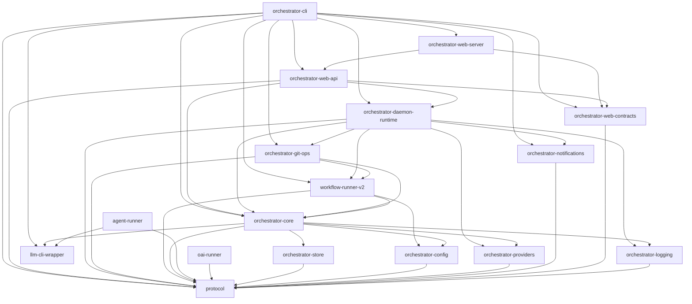

# Architecture Overview

Animus is a Rust-only agent orchestrator built as a Cargo workspace of around 20 crates. It provides a CLI (`animus`), a daemon runtime, a workflow runner, an agent runner, an MCP server (`animus.*` tool namespace), a web UI, and a plugin host for stdio-based subject and provider plugins.

For the public name and protocol contract see [Naming Contract](naming-contract.md). For the v0.3.x → v0.4.0 migration see [`docs/migration/v0.3-to-v0.4.md`](../migration/v0.3-to-v0.4.md).

## Crate Dependency Graph

`protocol` sits at the foundation for shared types, configuration shapes, and runtime path derivation.

`orchestrator-core` provides the domain services and state mutation APIs used by the CLI, web layer, and daemon.

`orchestrator-cli` composes the workspace into the user-facing `animus` command surface.

## Architecture Decision Records

- [Naming Contract](naming-contract.md) -- One name everywhere: `animus.*` for MCP tools, env vars, config dirs, pack ids, and JSON envelopes (v0.4.0 hard cut from the legacy `ao.*` surfaces)
- [Plugin Pack Kernel](plugin-pack-kernel.md) -- Package-style plugin architecture for workflows, MCP servers, and bundled domain modules
- [Project Init Templates](project-init-templates.md) -- Template-driven `animus init` architecture layered above packs
- [Subject Dispatch Daemon](subject-dispatch-daemon.md) -- How the daemon schedules and dispatches workflow subjects
- [Subject Backend Plugins](subject-backend-plugins.md) -- v0.4.0 plugin contract that lets external systems (Linear, Jira, GitHub Issues, Notion, ...) act as first-class subject sources alongside the native task store
- [Tool-Driven Mutation Surfaces](tool-driven-mutation-surfaces.md) -- How state mutations are channeled through tool abstractions
- [Workflow-First CLI](workflow-first-cli.md) -- Why workflows are the primary execution primitive
- [Phase Contracts](phase-contracts.md) -- Universal phase verdicts, YAML-defined fields, and runtime validation

## Deep Dives

- [Crate Map](crate-map.md) -- All workspace crates grouped by responsibility with descriptions
- [ServiceHub Pattern](service-hub.md) -- Dependency injection via the `ServiceHub` trait
- [llm-cli-wrapper Session Backends](llm-cli-wrapper-session-backends.md) -- Planned unified session facade for SDK-backed CLI integrations
