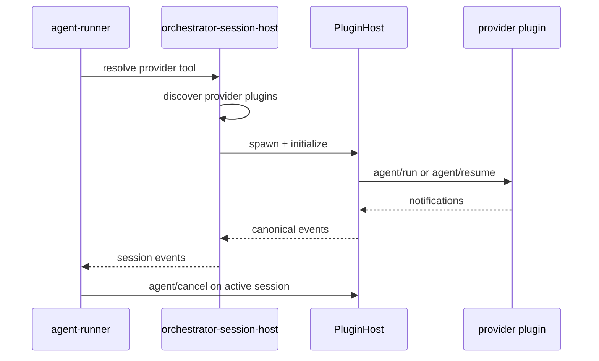

# Provider Session Host

This file keeps the historical `llm-cli-wrapper-session-backends.md` path for
old links, but the current implementation no longer has an in-tree
`llm-cli-wrapper` crate. Provider execution now crosses two boundaries:

1. `agent-runner` manages runner IPC, workspace validation, persistence, and
   orchestration.
2. `orchestrator-session-host` resolves and drives installed provider plugins
   through `orchestrator-plugin-host`.

For the broader plugin architecture, see [Plugin System](plugin-system.md).

## Source Files

| Area | Source |
|---|---|
| Provider resolver | [`crates/orchestrator-session-host/src/session_backend_resolver.rs`](../../crates/orchestrator-session-host/src/session_backend_resolver.rs) |
| Provider plugin backend | [`crates/orchestrator-session-host/src/plugin_backend.rs`](../../crates/orchestrator-session-host/src/plugin_backend.rs) |
| Provider supervisor | [`crates/orchestrator-session-host/src/plugin_supervisor.rs`](../../crates/orchestrator-session-host/src/plugin_supervisor.rs) |
| Agent runner process path | [`crates/agent-runner/src/`](../../crates/agent-runner/src/) |
| Stdio host | [`crates/orchestrator-plugin-host/src/host.rs`](../../crates/orchestrator-plugin-host/src/host.rs) |

## Current Flow

The resolver discovers plugins with `plugin_kind == "provider"`. There is no
in-tree provider fallback. If a requested provider is not installed, the resolver
returns a hard error with the install command.

## Provider Names

The resolver canonicalizes the OpenAI-compatible runner names:

- `oai-runner` -> `oai`
- `animus-oai-runner` -> `oai`

Reserved first-party provider names are:

- `claude`
- `codex`
- `gemini`
- `opencode`
- `oai`
- `oai-runner`

Installing a plugin that shadows a reserved provider name requires the explicit
override path in the plugin installer.

## Session Model

`PluginSessionBackend` spawns and handshakes a provider plugin for each
dispatch, then keeps a session map so follow-up operations can reach the same
live plugin host.

Important behavior:

- `agent/run` starts a new provider session.
- `agent/resume` resumes a provider-owned session when supported.
- `agent/cancel` routes through the existing active session host, not through a
  fresh plugin process.
- The default `agent/run` request timeout is 1800 seconds.
- The cancel timeout is 10 seconds.
- Provider retries happen once for death-like failures only when no
  notifications were forwarded yet.
- Structured JSON-RPC errors are surfaced directly and do not consume restart
  budget.

The supervisor default is three restarts in a 60 second window, followed by a
five minute cooldown.

## Event Boundary

Provider plugins emit JSON-RPC notifications while handling `agent/run` or
`agent/resume`. The host's single-reader router separates responses from
notifications, forwards provider events to the runner, and keeps pending
requests keyed by JSON-RPC id.

This keeps `agent-runner` focused on orchestration and persistence while
provider-specific launch, resume, event extraction, and cancellation behavior
live behind the provider plugin contract.
