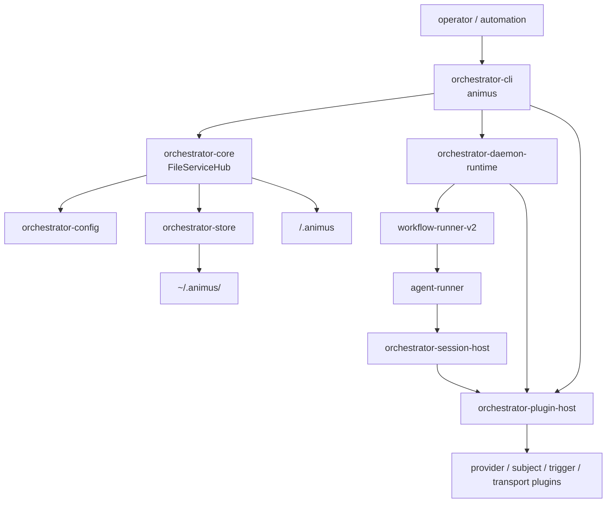

# Runtime Architecture

This document maps the current Animus runtime from CLI startup through daemon
dispatch, workflow execution, provider sessions, plugins, and persisted state.
When this document and code disagree, trust the source files listed here.

For the full end-to-end architecture narrative, including domain model,
control surfaces, daemon internals, workflow runner internals, security,
observability, and extension rules, see
[Full System Architecture](full-system-architecture.md).

## Source Files

| Area | Source |
|---|---|
| CLI entrypoint | [`crates/orchestrator-cli/src/main.rs`](../../crates/orchestrator-cli/src/main.rs) |
| Top-level command surface | [`crates/orchestrator-cli/src/cli_types/root_types.rs`](../../crates/orchestrator-cli/src/cli_types/root_types.rs) |
| Output envelope | [`crates/orchestrator-cli/src/shared/output.rs`](../../crates/orchestrator-cli/src/shared/output.rs) |
| Project root resolution | [`crates/orchestrator-core/src/config.rs`](../../crates/orchestrator-core/src/config.rs) |
| Service bootstrap and state | [`crates/orchestrator-core/src/services.rs`](../../crates/orchestrator-core/src/services.rs) |
| Workflow config loading | [`crates/orchestrator-config/src/workflow_config/`](../../crates/orchestrator-config/src/workflow_config/) |
| Shared config and scope types | [`crates/protocol/src/config.rs`](../../crates/protocol/src/config.rs), [`crates/protocol/src/repository_scope.rs`](../../crates/protocol/src/repository_scope.rs) |
| Workflow execution | [`crates/workflow-runner-v2/src/workflow_execute.rs`](../../crates/workflow-runner-v2/src/workflow_execute.rs) |
| Daemon runtime | [`crates/orchestrator-daemon-runtime/src/`](../../crates/orchestrator-daemon-runtime/src/) |
| Plugin host | [`crates/orchestrator-plugin-host/src/`](../../crates/orchestrator-plugin-host/src/) |
| Provider session bridge | [`crates/orchestrator-session-host/src/`](../../crates/orchestrator-session-host/src/) |
| Web plugin resolution | [`crates/orchestrator-cli/src/services/operations/ops_web.rs`](../../crates/orchestrator-cli/src/services/operations/ops_web.rs) |

## System Shape



## Workspace Responsibilities

| Layer | Crates | Responsibility |
|---|---|---|
| Interface | `orchestrator-cli` | CLI, MCP server, JSON output, operations, `animus web` plugin launch |
| Services | `orchestrator-core`, `orchestrator-config`, `orchestrator-store` | Bootstrap, config, state mutation APIs, workflow config, atomic persistence |
| Runtime | `orchestrator-daemon-runtime`, `workflow-runner-v2`, `agent-runner` | Queue scheduling, workflow phase execution, runner IPC and process orchestration |
| Providers | `orchestrator-session-host`, `oai-runner`, `orchestrator-providers` | Provider plugin sessions, OpenAI-compatible runner, compatibility helpers |
| Plugins | `orchestrator-plugin-host`, `animus-plugin-protocol`, `animus-plugin-runtime` | Discovery, manifests, stdio JSON-RPC host, runtime helpers |
| Support | `orchestrator-git-ops`, `orchestrator-notifications`, `orchestrator-logging`, `protocol` | Worktrees, notifications, tracing, shared types |

## Startup Flow

The workspace also depends on external `launchapp-dev/animus-protocol` crates.
The authoritative dependency pins live in the repo's `Cargo.toml` files,
especially the workspace root and `crates/orchestrator-cli/Cargo.toml`; the
current runtime mixes legacy `v0.1.13` provider/session wire crates with newer
`v0.5.1` queue/workflow/subject protocol crates.

Repo-local but not current workspace members: `orchestrator-web-server`.

1. Parse global flags and top-level command in `orchestrator-cli`.
2. Resolve the project root with this precedence:
   - `--project-root`
   - Git common root for the current directory or linked worktree
   - current working directory
3. Bootstrap project-local `.animus/` config files when needed.
4. Resolve the repository scope and scoped runtime state under
   `~/.animus/<repo-scope>/`.
5. Construct `FileServiceHub`.
6. Dispatch into the selected CLI operation, daemon runtime, runner path, MCP
   server, or web plugin operation.

## State Model

Animus splits project-local configuration from scoped runtime state.

Project-local config in `<project>/.animus/`:

- `config.json`
- `workflows.yaml`
- `workflows/*.yaml`
- `plugins.lock`

Scoped runtime state in `~/.animus/<repo-scope>/`:

- `core-state.json`
- `resume-config.json`
- `workflow.db`
- `config/`
- `daemon/`
- `docs/`
- `logs/`
- `runner/`
- `state/`
- `worktrees/`

Global state in `protocol::Config::global_config_dir()` includes credentials,
daemon events, CLI tracker state, plugin registry, and runner sockets.

`<repo-scope>` is derived from the sanitized repository name plus a 12-character
SHA256 prefix of the canonical root. Managed worktrees live under the scoped
`worktrees/` directory.

## Control Surfaces

| Surface | Runtime path |
|---|---|
| CLI | `orchestrator-cli` operations, usually via `FileServiceHub` |
| MCP | `orchestrator-cli` MCP operation modules and `animus.*` tool namespace |
| Daemon control | Unix socket control protocol when daemon is running |
| Web | external transport and web UI plugins launched by `animus web` |
| Plugins | stdio JSON-RPC through `orchestrator-plugin-host` |

The web stack is not bundled in-tree. `animus web serve` and `animus web open`
discover installed `transport_backend` and `web_ui` plugins.

## Execution Pipeline

1. A subject or queue entry selects work.
2. The daemon starts a workflow run through `workflow-runner-v2`.
3. The workflow runner resolves phase configuration and runtime contracts.
4. Agent phases call `agent-runner`.
5. `agent-runner` delegates provider execution to `orchestrator-session-host`.
6. `orchestrator-session-host` discovers and drives a provider plugin through
   `orchestrator-plugin-host`.
7. Events flow back through the runner, workflow state, daemon output, and logs.
8. Terminal state is persisted in scoped runtime state and surfaced through CLI,
   MCP, web transports, and output commands.

## Daemon Responsibilities

The daemon owns scheduling and runtime coordination:

- queue dispatch
- cron/reactive scheduling
- trigger plugin watching
- subject plugin routing
- workflow process management
- daemon events and health
- plugin preflight before autonomous work

The daemon should not own provider-specific session logic, web UI implementation,
or external system-of-record semantics.

## Plugin Boundaries

External integrations run as standalone executables. The host communicates over
JSON-RPC 2.0 on stdin/stdout; canonical writes remain newline-delimited and the
host readers also tolerate pretty-printed multi-line frames from plugins.
Plugin environments are cleared before spawn. Plugin behavior is documented in
[Plugin System](plugin-system.md).

The key runtime split is:

- subject and trigger plugins are daemon-facing
- provider plugins are session-host-facing
- transport and web UI plugins are `animus web`-facing
- log storage plugins are runtime logging-facing

## Failure Boundaries

| Failure | Boundary |
|---|---|
| Missing provider or subject plugin | daemon preflight fails by default |
| Plugin manifest probe failure | discovery warning, plugin skipped |
| Provider process death before any event | provider dispatch may retry once |
| Structured plugin JSON-RPC error | surfaced without consuming restart budget |
| Subject kind not claimed | `METHOD_NOT_FOUND` for that kind |
| Web plugin missing | `animus web` reports install/remediation command |

## Verification

Use source checks for architecture-affecting changes:

```bash
cargo animus-bin-check
cargo test -p orchestrator-plugin-host
cargo test -p orchestrator-session-host
cargo test -p orchestrator-cli
```
