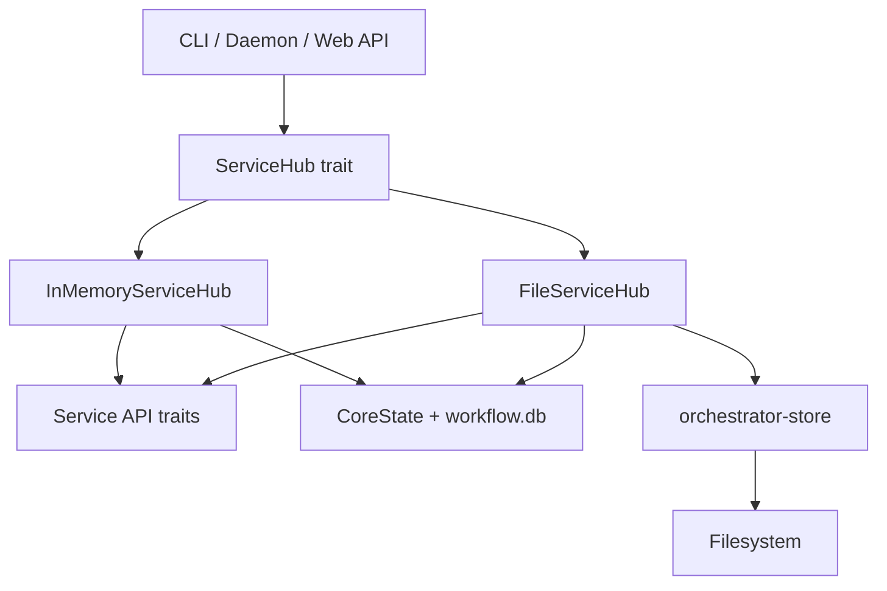

# ServiceHub Pattern

The `ServiceHub` trait is Animus's dependency injection boundary. It gives the CLI, daemon, tests, and web layers one uniform way to access domain services.

## The Trait

Defined in `crates/orchestrator-core/src/services.rs`, `ServiceHub` exposes the core service APIs:

- `daemon()`
- `projects()`
- `tasks()`
- `task_provider()`
- `subject_resolver()`
- `workflows()`
- `planning()`
- `requirements_provider()`
- `project_adapter()`
- `review()`

Each accessor returns an `Arc<dyn Trait>` so callers can share service implementations across async boundaries.

## Production: `FileServiceHub`

`FileServiceHub` is the production implementation.

At startup it:

1. resolves the project root
2. bootstraps `.animus/` project config and the repo-scoped runtime root under `~/.animus/<repo-scope>/`
3. loads `core-state.json`
4. loads persisted workflows, tasks, and requirements from `workflow.db`
5. returns a service hub backed by filesystem and SQLite state

Important runtime files:

```text
~/.animus/<repo-scope>/
├── core-state.json
├── resume-config.json
├── workflow.db
├── config/state-machines.v1.json
├── state/
├── daemon/
└── worktrees/
```

`FileServiceHub` uses file locking around `core-state.json` mutations so concurrent CLI invocations and daemon work do not trample each other.

## Tests: `InMemoryServiceHub`

`InMemoryServiceHub` keeps the same service surface but stores everything in
memory. That lets tests exercise the same business logic without filesystem
I/O.

When a test needs plugin-backed subject or project fallback behavior, construct
the hub with `InMemoryServiceHub::new().with_project_root(...)`. Without a
project root, `subject_resolver()` and `project_adapter()` stay in-memory-only
and intentionally skip plugin fallback wiring.

## Dependency Flow



All higher layers depend on `ServiceHub` and the service traits, not on concrete storage details.
