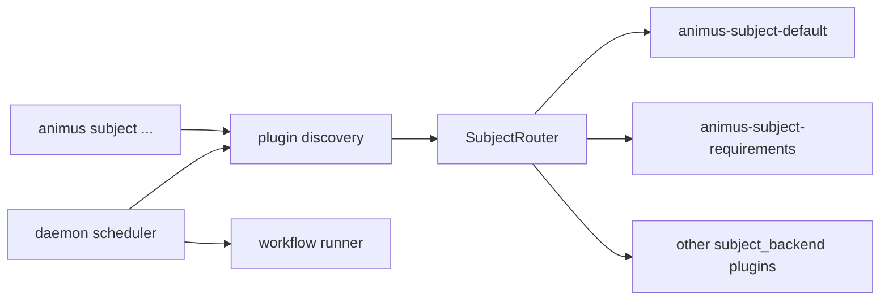

# Subject Backend Plugins

Subject backends are stdio plugins that make external systems of record
dispatchable by Animus. A backend can represent local tasks, requirements,
Linear issues, SQLite rows, markdown files, or any other work source, but the
daemon sees one normalized `Subject` shape and one kind-based routing contract.

This document describes the current source-backed contract. For the full plugin
host lifecycle, discovery, install state, provider path, transport path, and
security boundary, see [Plugin System](plugin-system.md).

## Source Files

| Area | Source |
|---|---|
| Normalized schema and Rust trait | External `animus-subject-protocol` dependency in `Cargo.toml` (repo-local mirror at [`crates/animus-subject-protocol/src/lib.rs`](../../crates/animus-subject-protocol/src/lib.rs)) |
| Kind router | [`crates/orchestrator-plugin-host/src/subject_router.rs`](../../crates/orchestrator-plugin-host/src/subject_router.rs) |
| Daemon subject plugin dispatch | [`crates/orchestrator-daemon-runtime/src/subject_dispatch.rs`](../../crates/orchestrator-daemon-runtime/src/subject_dispatch.rs) |
| CLI subject command dispatch | [`crates/orchestrator-cli/src/services/operations/ops_subject.rs`](../../crates/orchestrator-cli/src/services/operations/ops_subject.rs) |
| Plugin preflight roles | [`crates/orchestrator-core/src/plugin_preflight/`](../../crates/orchestrator-core/src/plugin_preflight/) |
| Curated default subject plugins | [`crates/orchestrator-core/src/plugin_registry.rs`](../../crates/orchestrator-core/src/plugin_registry.rs) |

## Current Invariants

- Subject data comes from installed plugins of kind `subject_backend`.
- The in-tree task and requirement adapters were removed; there is no native
  fallback for new daemon runs.
- Daemon preflight requires routable `task` and `requirement` subject kinds
  unless the operator bypasses preflight.
- Plugin discovery is shared with every other plugin kind and uses the registry,
  project-local plugin directory, explicit plugin environment variables, and
  optional system PATH scanning.
- Subject routing is by initialized `capabilities.subject_kinds`, not by binary
  name or install source.
- Duplicate exact kind claims fail router setup. Duplicate glob prefixes fail
  setup. Exact kinds beat globs. The longest matching glob prefix wins.
- The subject id is backend-qualified and opaque to the daemon.

The default subject plugins are installed with:

```bash
animus plugin install-defaults --include-subjects
```

The curated set currently covers the default task backend, requirements, Linear,
SQLite, and markdown subject sources.

## Runtime Topology



The CLI path and daemon path use the same underlying router:

1. Discover installed plugins.
2. Filter to manifests with `plugin_kind == "subject_backend"`.
3. Spawn each backend with a scrubbed environment.
4. Send `initialize`.
5. Read `InitializeResult.capabilities.subject_kinds`.
6. Build an immutable `SubjectRouter`.
7. Route `<kind>/<verb>` calls to the plugin that claimed the kind.

When the daemon is running, subject routing is resolved during startup and then
held as immutable runtime state. The standalone CLI subject commands also build a
one-shot dispatch so they work even when the daemon is not already running.

## Method Boundary

There are two related method namespaces:

| Layer | Method shape | Purpose |
|---|---|---|
| Operator/control surface | `subject/list`, `subject/get`, `subject/update`, ... | Generic daemon, MCP, and CLI control methods |
| Plugin router | `<kind>/list`, `<kind>/get`, `<kind>/update`, ... | Calls sent to the backend that claimed `kind` |

The control layer adapts generic `subject/*` calls into kind-scoped plugin
methods. For example, a control request to list `kind=task` is routed as
`task/list`. A request for `kind=requirement` is routed as `requirement/list`.

For task/requirement subject context lookups, the provider-side fallback path
first probes the bare aliases (`task/get`, `requirement/get`) across plugins
that explicitly advertise those methods, then falls through to canonical
namespaced kinds (`animus.task/get`, `animus.requirement/get`) when needed.
This preserves compatibility with the default subject plugins while avoiding
false negatives from generic dispatchers that return non-`METHOD_NOT_FOUND`
errors for ids they do not own.

The current CLI and daemon path uses this plugin method family:

| Plugin method | Purpose |
|---|---|
| `<kind>/list` | Return filtered subjects for dispatch or CLI listing |
| `<kind>/get` | Fetch one subject |
| `<kind>/create` | Create one subject when the backend supports mutation |
| `<kind>/update` | Apply a patch to an existing subject |
| `<kind>/next` | Return the next runnable subject for the kind |
| `<kind>/status` | Change a subject status |

The `animus-subject-protocol` crate also defines protocol-level constants such
as `subject/list`, `subject/schema`, and `subject/watch`. Those names describe
the normalized protocol vocabulary and helper trait, while current host routing
uses the kind-scoped methods above.

## Kind Routing

A subject backend declares routable kinds in
`InitializeResult.capabilities.subject_kinds`.

Examples:

```json
{
  "capabilities": {
    "subject_kinds": ["task", "requirement", "linear.*"]
  }
}
```

Routing rules:

| Rule | Example |
|---|---|
| Exact kind wins | `task` handles `task/get` |
| Glob kind uses `.*` | `linear.*` can handle `linear.issue/list` |
| Exact beats glob | `linear.issue` wins over `linear.*` for `linear.issue/get` |
| Longest glob wins | `linear.project.*` wins over `linear.*` |
| Duplicate exact claims fail | Two plugins cannot both claim `task` |
| Duplicate glob prefixes fail | Two plugins cannot both claim `linear.*` |

The router extracts the method prefix before `/`, resolves that prefix to a
plugin, and forwards the original method and JSON params unchanged.

## Normalized Subject

The daemon treats every backend subject as the same high-level shape:

| Field | Meaning |
|---|---|
| `id` | Backend-qualified opaque id, such as `linear:ENG-123` or `sqlite:01...` |
| `kind` | Routing kind, such as `task`, `requirement`, `linear.issue` |
| `title` | Short human-readable title |
| `description` | Optional long-form body |
| `status` | Normalized dispatch status |
| `priority` | Optional priority bucket |
| `assignee` | Optional backend-specific assignee id |
| `labels` | Backend-specific labels or tags |
| `parent` / `children` | Optional hierarchy links |
| `url` | Optional source-system URL |
| `created_at` / `updated_at` | Optional timestamps |
| `custom` | Backend-owned JSON fields |

Status values are normalized by the protocol so workflows can reason across
backends:

- `ready`
- `in-progress`
- `blocked`
- `done`
- `cancelled`

Backends remain responsible for mapping their native statuses into these
normalized values.

## CLI Behavior

`animus subject` resolves a kind using:

1. `--kind <kind>`
2. `.animus/config.json` `default_subject_kind`
3. an error telling the operator to pass `--kind` or set the default

The CLI validates that the kind is non-empty and does not contain `/`, then
builds the method as `<kind>/<verb>`.

Example:

```bash
animus subject list --kind task --status ready
```

routes as:

```text
task/list
```

with JSON params containing the kind, status filter, and optional limit.

## Daemon Behavior

At daemon startup, subject plugin dispatch is resolved once:

1. If `ANIMUS_DAEMON_DISABLE_SUBJECT_PLUGINS` is truthy, dispatch is empty.
2. If no subject backend plugins are discovered, dispatch is empty.
3. Otherwise, each subject backend is spawned with cwd pinned to
   `project_root`, then initialized.
4. The router is built from initialized capabilities.
5. Duplicate or invalid kind claims surface as startup warnings or errors,
   depending on the caller path.

An empty dispatch makes every `<kind>/<verb>` call fail with a
`METHOD_NOT_FOUND` JSON-RPC error. Daemon preflight exists to catch the common
case before autonomous work starts.

## Authoring Rules

A subject backend should:

- use `plugin_kind = "subject_backend"` in its manifest
- return stable, backend-qualified ids
- declare every kind it can route in `capabilities.subject_kinds`
- keep kind names free of `/`
- make `list`, `get`, `next`, and status mutation behavior deterministic
- preserve backend-specific fields in `custom`
- return structured JSON-RPC errors instead of process exits for ordinary
  backend failures
- declare required environment variables in `env_required`

Scaffold a backend with:

```bash
animus plugin new --kind subject --name <name>
```

Then install it locally for testing:

```bash
animus plugin install --path ./target/release/animus-subject-<name>
animus plugin call <name> task/list --json '{}'
```

## Failure Modes

| Failure | Result |
|---|---|
| Missing `task` or `requirement` plugin | daemon preflight fails by default |
| Kind not claimed | `METHOD_NOT_FOUND` for the requested kind |
| Duplicate exact kind | router setup fails with both plugin names |
| Duplicate glob prefix | router setup fails with both plugin names |
| Plugin exits during request | host returns a structured transport/host error |
| Disable env var set | subject dispatch is empty |

Use these commands while debugging:

```bash
animus plugin list
animus daemon preflight
animus subject list --kind task --json
animus plugin call <plugin-name> task/list --json '{}'
```

## Tests

The important contract tests live near the implementation:

- `crates/orchestrator-plugin-host/src/subject_router.rs`
- `crates/orchestrator-daemon-runtime/src/subject_dispatch.rs`
- `crates/orchestrator-core/src/plugin_preflight/tests.rs`
- `crates/orchestrator-cli/tests/plugin_contract_e2e.rs`

Run the runtime binary check before shipping plugin or subject routing changes:

```bash
cargo animus-bin-check
```
