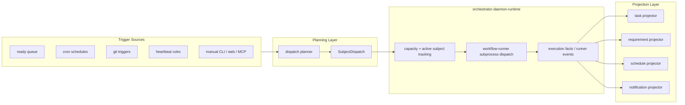
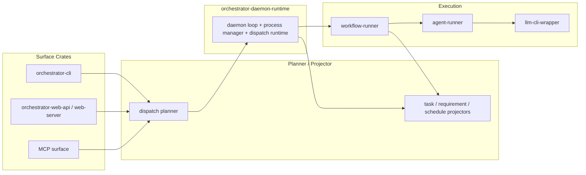

# Subject Dispatch Daemon Architecture

## Purpose

AO needs one execution model for schedules, ready-queue work, manual starts, git
triggers, and heartbeat rules. The daemon should not be a task-centric state
machine. It should be a dumb, pluggable runtime that accepts dispatchable work,
manages capacity and subprocesses, and emits execution facts.

The planning and projection logic should live around the daemon, not inside it.

## Core Decision

The daemon runtime processes `SubjectDispatch`, not raw tasks.

- `WorkflowSubject` is identity only.
- `SubjectDispatch` is the execution envelope.
- Planner layers produce dispatches.
- The daemon runtime consumes dispatches and emits execution facts.
- Projector layers apply those facts back to tasks, requirements, schedules, and
  notifications.

## Definitions

### `WorkflowSubject`

Identity of the work item:

- `task`
- `requirement`
- `custom`

`WorkflowSubject` does not own execution configuration.

### `SubjectDispatch`

Execution envelope for a subject. At minimum it should include:

- `subject`
- `pipeline_id`
- `input`
- `trigger_source`
- `priority`
- `requested_at`
- optional idempotency or dispatch key

`pipeline_id` belongs here, not on `WorkflowSubject`.

### Planner

Produces `SubjectDispatch` values from:

- ready queue
- cron schedules
- git triggers
- heartbeat or proactive rules
- manual CLI, web, or MCP starts

The planner may consult tasks, requirements, schedules, git state, or policy,
but it should output dispatchable work rather than owning daemon runtime
behavior.

### Daemon Runtime

Consumes dispatches, manages capacity, spawns `workflow-runner`, tracks active
subjects, and emits execution facts.

The daemon runtime should know about:

- subjects
- dispatch envelopes
- slots and headroom
- subprocess lifecycle
- runner telemetry
- workflow execution events

The daemon runtime should not own task status policy, backlog promotion, retry
policy, or requirement-specific state transitions.

### Projectors

Project execution facts back onto domain state:

- task projector
- requirement projector
- schedule projector
- notification projector

Projectors are where state-specific updates belong.

## Target Flow

## Crate Responsibilities

## Non-Goals

These responsibilities should not stay in the daemon core:

- task blocking policy
- backlog promotion rules
- task retry policy
- requirement lifecycle transitions
- schedule history projection
- notification formatting

If the daemon needs those outcomes, it should emit facts that a projector or
planner consumes.

## Migration Guidance

### Keep

- `workflow-runner` as the canonical execution host
- `agent-runner` as the process supervisor for model CLIs
- `WorkflowSubject` as the stable identity model

### Change

1. Replace task-first daemon entrypoints with `SubjectDispatch`.
2. Move planning logic out of daemon runtime modules and into planner services.
3. Move task, requirement, and schedule writeback logic into projector services.
4. Keep `orchestrator-cli` as command parsing, launching, and output only.

## Acceptance Shape

The architecture is correct when:

- every workflow start is expressed as `SubjectDispatch`
- the daemon runtime can run standalone without task-specific policy
- task, requirement, and schedule state changes happen in projectors
- manual starts, schedules, queue dispatch, git triggers, and heartbeat rules
  all share the same dispatch contract
- `workflow-runner` remains the only workflow execution host
