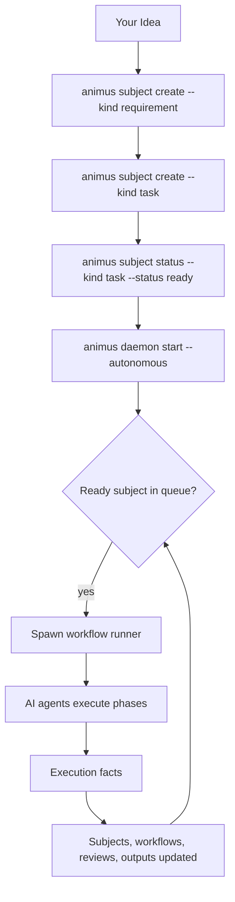

# A Typical Day Using Animus

Animus is built for continuous execution. You define work through the subject
surface, mark it ready, and let the daemon or workflow runtime execute it.

## The Autonomous Workflow



## Typical Flow

### 1. Create work

```bash
animus subject create --kind requirement \
  --title "Rate limiting rollout" \
  --body "Protect the API from burst traffic."

animus subject create --kind task \
  --title "Add rate limiting" \
  --body "Implement request throttling before upstream calls." \
  --priority p1
```

### 2. Mark a task ready

```bash
animus subject status --kind task --id task:TASK-001 --status ready
```

### 3. Start the daemon

```bash
animus daemon start --autonomous
```

### 4. Monitor progress

```bash
animus status
animus subject list --kind task
animus workflow list
animus daemon health
animus logs tail
```

## Testing a Workflow Before Enabling the Daemon

```bash
animus workflow run --task-id TASK-001 --sync
```

Use synchronous runs to debug a workflow definition, prompt, or plugin setup in
the current terminal.

## Separation of Concerns

- Project configuration lives in `.animus/`.
- Repo-scoped runtime state lives in `~/.animus/<repo-scope>/`.
- Workflow logic lives in YAML.
- The daemon is a scheduler, not the place where product policy lives.
