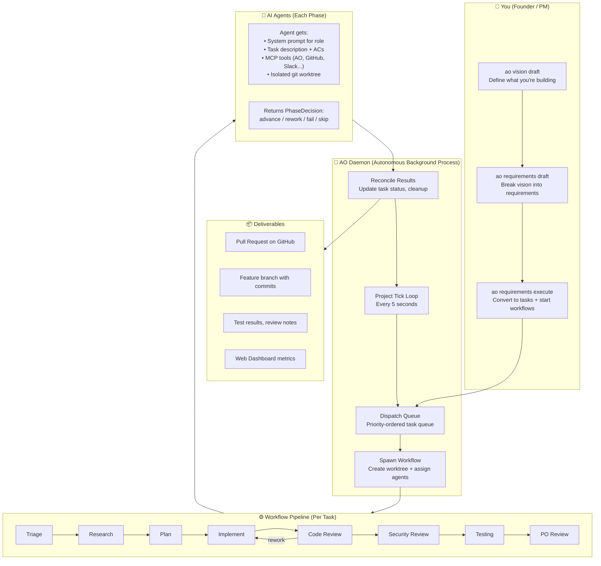
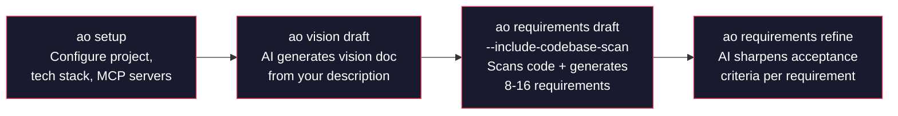
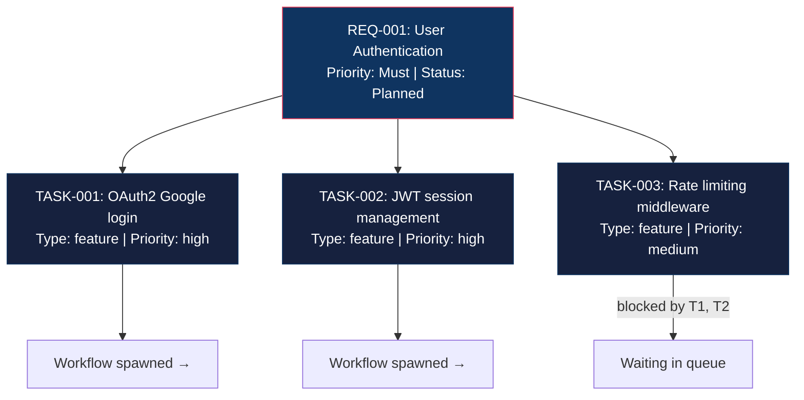
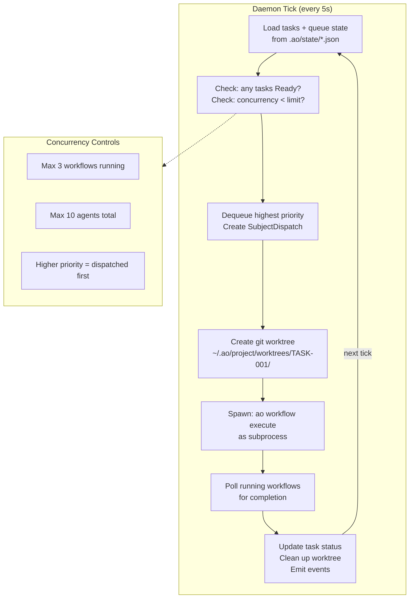
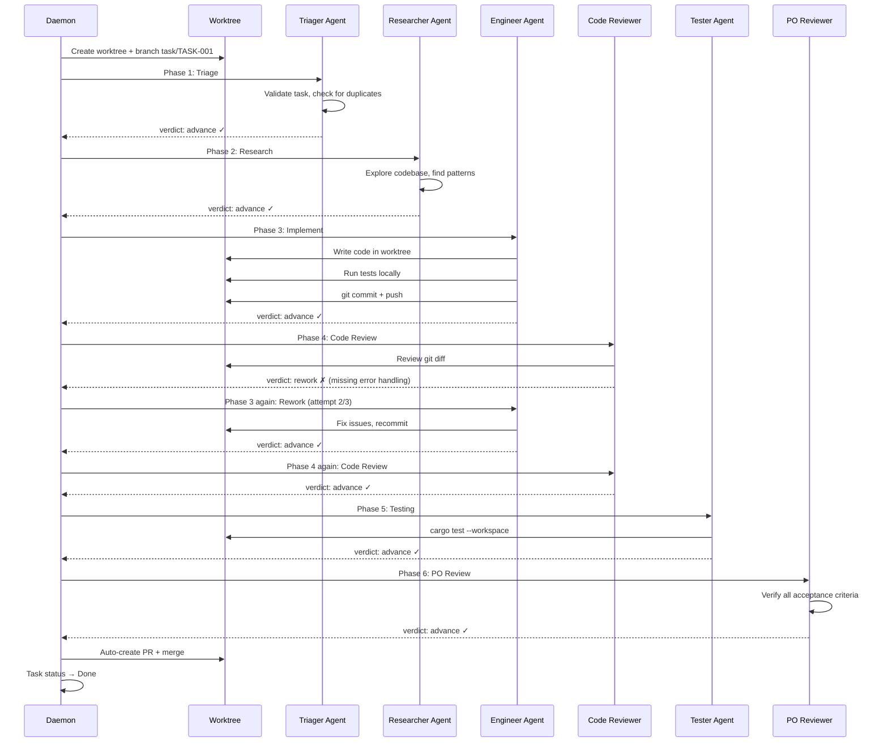
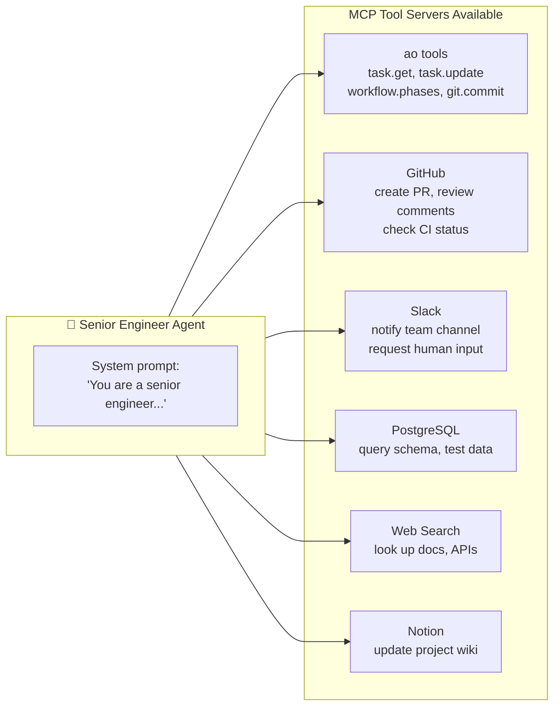
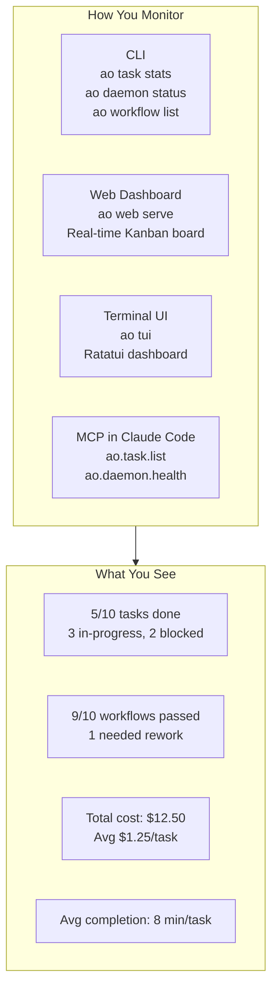
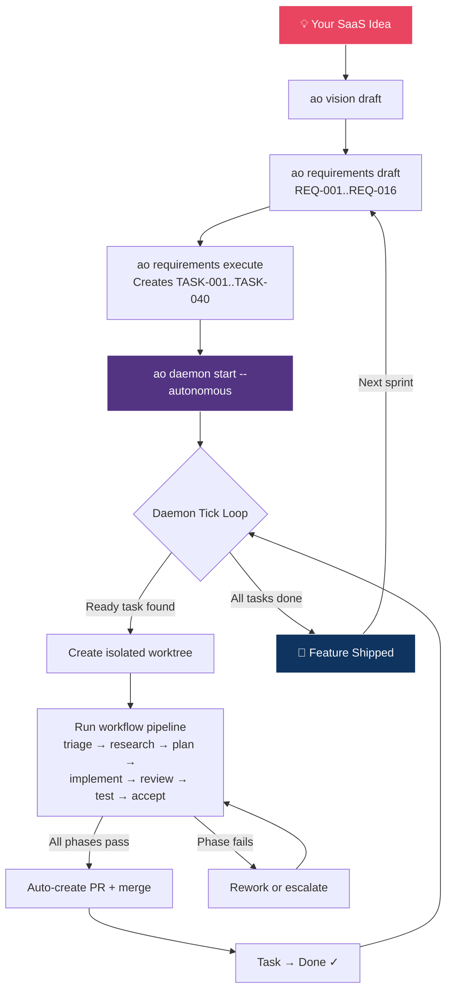

# How AO Works: End-to-End Guide

> From idea to shipped code — how a SaaS company uses AO to orchestrate AI agents across the entire software delivery lifecycle.

## The Big Picture



---

## Step-by-Step: Building Your SaaS

### Phase 1: Define What You're Building



You describe your SaaS idea. AO generates a **vision document**, breaks it into **requirements** (REQ-001, REQ-002...) with priorities (Must/Should/Could), and refines each with acceptance criteria.

**Commands:**

```bash
ao setup                                          # Interactive project setup
ao vision draft                                   # Generate vision from description
ao requirements draft --include-codebase-scan     # Scan code + generate requirements
ao requirements refine --requirement-ids REQ-001  # Sharpen acceptance criteria
```

### Phase 2: Requirements Become Tasks



`ao requirements execute` creates tasks and immediately starts the daemon working on them. Tasks respect **dependency ordering** — TASK-003 waits until TASK-001 and TASK-002 are done.

**The hierarchy:**

| Level | Entity | Example |
|-------|--------|---------|
| Vision | Single document | "Build a project management SaaS" |
| Requirements | REQ-001..REQ-016 | "User authentication with OAuth2" |
| Tasks | TASK-001..TASK-040 | "Implement Google OAuth2 login flow" |

**Task metadata includes:** type (feature/bugfix/refactor), priority (critical/high/medium/low), risk level, impact areas (frontend/backend/API/infra), assignee, dependencies, acceptance criteria, and worktree path.

### Phase 3: The Daemon Orchestrates Everything



The daemon is the brain. It runs autonomously in the background, picking up ready tasks, spawning workflows in isolated git worktrees, and reconciling results.

**Commands:**

```bash
ao daemon start --autonomous  # Fork background daemon
ao daemon status              # Check if running
ao daemon pause               # Pause scheduling (finish in-flight work)
ao daemon resume              # Resume scheduling
ao daemon stop                # Graceful shutdown
```

**What happens each tick:**

1. **Load state** — reads tasks, workflows, dispatch queue from `.ao/state/`
2. **Queue candidates** — identifies tasks in `Ready` status
3. **Apply limits** — respects max concurrent workflows and agents
4. **Dispatch** — dequeues highest priority task, creates `SubjectDispatch` envelope
5. **Spawn** — creates git worktree, launches `ao workflow execute` subprocess
6. **Poll** — checks running workflows for completion
7. **Reconcile** — updates task status, cleans up worktrees, emits events

### Phase 4: Each Task Runs Through a Workflow Pipeline



Each agent is a **specialized AI persona** with its own system prompt, model, and MCP tool access. If code review fails, the engineer gets sent back to rework — up to a configurable maximum before escalating.

**Workflow definitions** live in `.ao/workflows/` as YAML:

```yaml
pipelines:
  standard-workflow:
    phases:
      - id: triage
        agent: triager
      - id: research
        agent: researcher
      - id: implementation
        agent: senior-engineer
        max_reworks: 3
      - id: code-review
        agent: code-reviewer
      - id: testing
        agent: integration-tester
      - id: po-review
        agent: po-reviewer
    post_success:
      auto_merge: true
      auto_pr: true
```

**Phase decisions** returned by agents:

| Verdict | Meaning |
|---------|---------|
| `advance` | Phase passed, move to next |
| `rework` | Send back to previous phase for fixes |
| `skip` | Phase not applicable, skip it |
| `fail` | Unrecoverable failure, stop workflow |

### Phase 5: Agents Have Superpowers via MCP



Agents aren't just coding — they can interact with your entire tool stack. A researcher agent can search the web, an engineer can query your database schema, and a PO reviewer can update Notion.

**MCP servers are configured per workflow:**

```yaml
mcp_servers:
  ao:
    command: ao
    args: [mcp, serve]
  github:
    command: npx
    args: [-y, @modelcontextprotocol/server-github]
    env:
      GITHUB_PERSONAL_ACCESS_TOKEN: ${GITHUB_TOKEN}
  slack:
    command: npx
    args: [-y, @anthropic/mcp-server-slack]
    env:
      SLACK_BOT_TOKEN: ${SLACK_BOT_TOKEN}
```

**Agent profiles define specialized personas:**

| Agent | Role | Tools |
|-------|------|-------|
| `triager` | Validates tasks, detects duplicates | ao |
| `researcher` | Gathers evidence, explores patterns | ao, web-search |
| `senior-engineer` | Writes production code | ao, github |
| `code-reviewer` | Reviews diffs for bugs and edge cases | ao, github |
| `security-reviewer` | Validates against OWASP, secrets exposure | ao |
| `integration-tester` | Runs test suites, checks coverage | ao |
| `po-reviewer` | Verifies acceptance criteria are met | ao, notion |

### Phase 6: Monitor Everything



**Monitoring commands:**

```bash
ao task stats                    # Task breakdown by status/priority/type
ao task prioritized              # View priority-ordered task list
ao daemon status                 # Daemon health + active workflows
ao daemon logs                   # Review daemon log output
ao workflow list                 # All workflows with phase progress
ao workflow get <id>             # Full workflow with decision history
ao web serve                     # Launch web dashboard
ao tui                           # Terminal UI dashboard
```

---

## The Full Lifecycle



**The short version:** You describe what to build. AO breaks it into tasks, assigns AI agents to each one, runs them through a quality pipeline (triage → research → code → review → test → accept), and delivers PRs. You review and merge.

---

## Key Architecture Patterns

### Isolated Worktrees

Every task executes in its own git worktree — an isolated copy of the repository at `~/.ao/<repo-scope>/worktrees/<task-id>/`. Agents can write code, run tests, and commit without interfering with each other or your working directory.

### Subject Dispatch

All work flows through a unified `SubjectDispatch` envelope:

```
SubjectDispatch {
    subject: Task { id: "TASK-001" } | Requirement { id: "REQ-001" } | Custom { ... },
    workflow_ref: "standard-workflow",
    trigger: Schedule | Manual | Queue,
}
```

This means the same dispatch pipeline handles scheduled cron jobs, manual fires, and priority-queue picks.

### Atomic Persistence

All state is persisted via atomic writes (write to temp file → sync → rename). This prevents corruption if the daemon crashes mid-write. State lives in `.ao/state/*.json`.

### Self-Correcting Pipelines

The rework loop is the quality guarantee. When a code reviewer finds issues, it sends work back to the engineer with failure context. The engineer sees exactly what went wrong and fixes it. Up to 3 rework cycles before escalating to a human.

### Failure Recovery

- **Phase fails** → retried up to configured max
- **All retries exhausted** → workflow fails, task marked blocked
- **Daemon crashes** → orphan recovery on next startup
- **Merge conflicts** → AI-powered conflict resolution attempts before escalating

---

## Example: A Typical Day

```
Morning:
  $ ao requirements execute --requirement-ids REQ-005..REQ-008 --start-workflows
  → 12 tasks created, daemon picks them up

  $ ao daemon status
  → 3 workflows running, 9 queued

Afternoon:
  $ ao task stats
  → 7 done, 3 in-progress, 2 blocked (waiting on dependency)

  $ ao workflow list --status failed
  → 1 workflow failed at security-review (hardcoded API key detected)
  → Agent auto-reworked, now passing

Evening:
  $ ao task stats
  → 11 done, 1 in-progress

  $ gh pr list
  → 11 PRs ready for review
  → Review, approve, merge
```
