# How AO Works: End-to-End Guide

> From idea to shipped code — how a SaaS company uses AO to orchestrate AI agents across the entire software delivery lifecycle.

## Core Principle

**Everything is a YAML workflow.**

The CLI doesn't contain AI logic. It dispatches YAML-defined workflows through a single execution path. Vision drafting, requirements generation, code implementation, review — they're all workflows. The CLI is the remote control. The workflows are the brains.

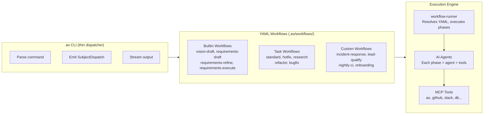

---

## The Big Picture

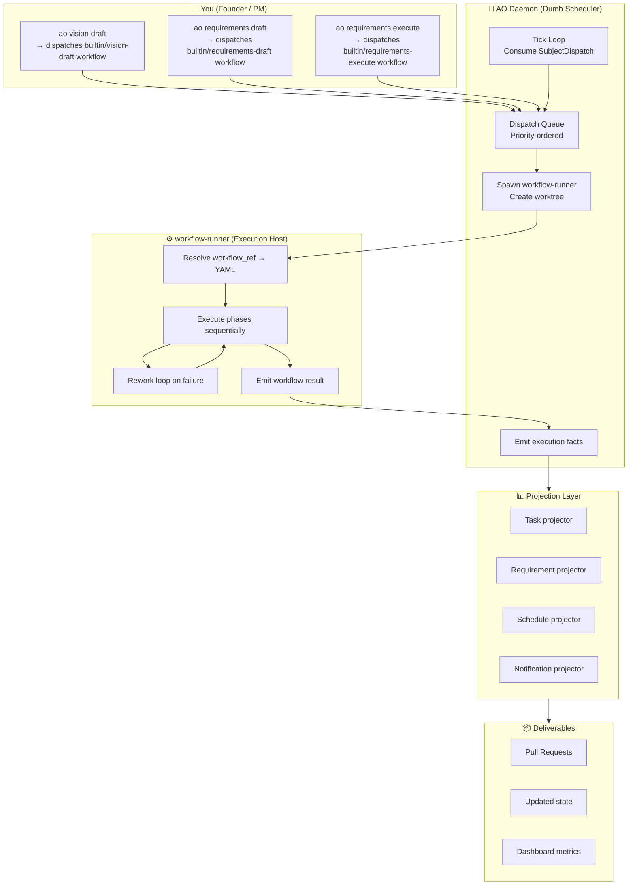

---

## Architecture: Three Layers

AO has exactly three layers. Each has a single responsibility.

### Layer 1: Surfaces (CLI, Web, MCP)

Surfaces accept user input and produce `SubjectDispatch` values. They never run AI directly.

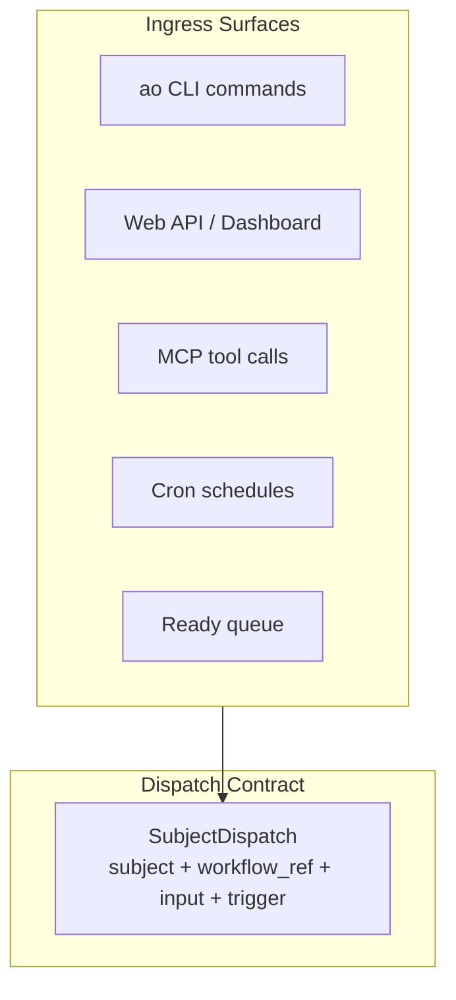

A `SubjectDispatch` is the universal work envelope:

```
SubjectDispatch {
    subject: Task { id } | Requirement { id } | Custom { title, description },
    workflow_ref: "builtin/vision-draft" | "standard-workflow" | "custom/my-workflow",
    input: { variables, context },
    trigger_source: Manual | Schedule | Queue,
    priority: high,
    requested_at: timestamp,
}
```

Every workflow start — whether from `ao vision draft`, a cron schedule, the ready queue, or an MCP tool call — produces the same envelope.

### Layer 2: Daemon Runtime (Dumb Scheduler)

The daemon consumes `SubjectDispatch`, manages capacity, spawns `workflow-runner` subprocesses, and emits execution facts. It does not know about tasks, requirements, or business logic.

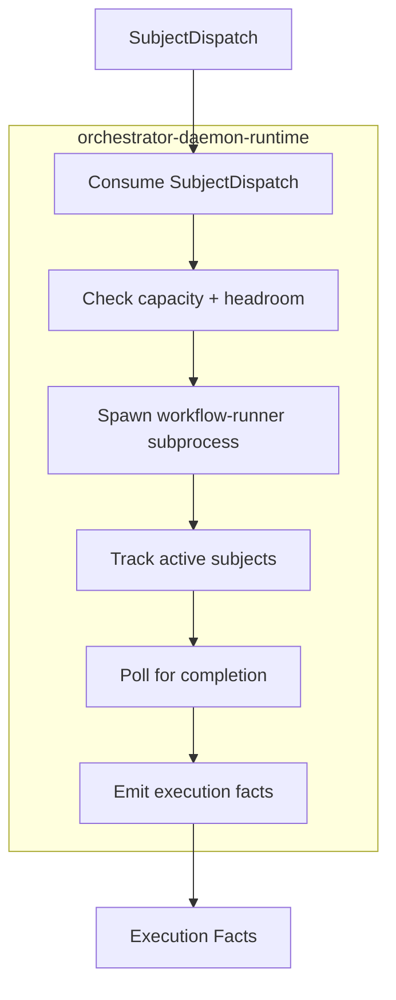

**The daemon knows about:** subjects, dispatch envelopes, slots, headroom, subprocess lifecycle, runner telemetry.

**The daemon does NOT know about:** task status policy, backlog promotion, retry policy, requirement transitions, AI logic, git workflow policy.

### Layer 3: Workflow Runner (Execution Host)

`workflow-runner` resolves `workflow_ref` from YAML and executes phases. This is where all AI behavior lives.

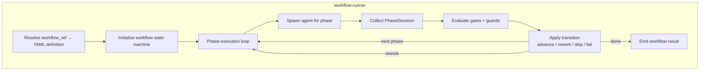

---

## Everything Is a Workflow

### Builtin Workflows

These ship with AO and handle the planning lifecycle. They are YAML workflows executed by `workflow-runner`, not hardcoded Rust operations.

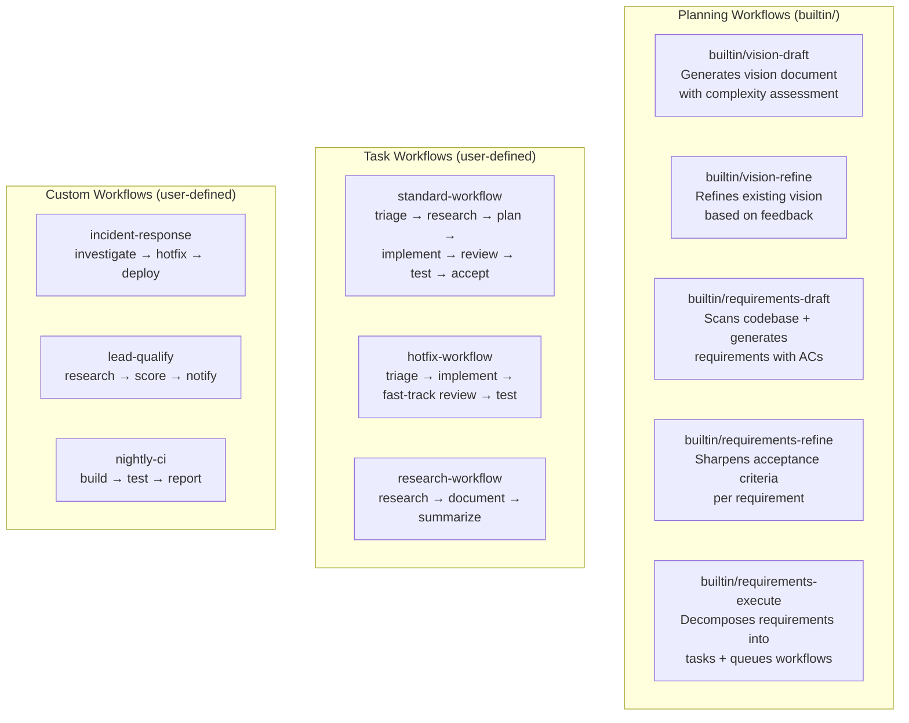

**CLI commands map directly to workflow dispatches:**

| Command | Dispatches | Subject |
|---------|-----------|---------|
| `ao vision draft` | `builtin/vision-draft` | `Custom { title: "vision-draft" }` |
| `ao vision refine` | `builtin/vision-refine` | `Custom { title: "vision-refine" }` |
| `ao requirements draft` | `builtin/requirements-draft` | `Custom { title: "requirements-draft" }` |
| `ao requirements refine --ids REQ-001` | `builtin/requirements-refine` | `Requirement { id: "REQ-001" }` |
| `ao requirements execute --ids REQ-001` | `builtin/requirements-execute` | `Requirement { id: "REQ-001" }` |
| `ao workflow run --ref standard-workflow` | `standard-workflow` | `Task { id: "TASK-001" }` |

### Example: Builtin Vision Draft Workflow

```yaml
# .ao/workflows/builtin/vision-draft.yaml
id: builtin/vision-draft
name: Vision Draft
description: Generate a vision document with complexity assessment

agents:
  vision-analyst:
    model: claude-sonnet-4-6
    system_prompt: |
      You are a product strategist. Analyze the project context and produce
      a vision document covering: problem statement, target users, goals,
      constraints, value proposition, and complexity assessment.
    mcp_servers: [ao, web-search]

pipelines:
  default:
    phases:
      - id: draft
        agent: vision-analyst
      - id: complexity-assessment
        agent: vision-analyst
        system_prompt_override: |
          Review the draft vision and produce a complexity assessment
          (simple/medium/complex) with justification.
    post_success:
      save_artifact: vision.json
```

### Example: Builtin Requirements Execute Workflow

```yaml
# .ao/workflows/builtin/requirements-execute.yaml
id: builtin/requirements-execute
name: Requirements Execute
description: Decompose requirements into tasks and queue workflows

agents:
  task-planner:
    model: claude-sonnet-4-6
    system_prompt: |
      You are a technical project manager. Given requirements with acceptance
      criteria, decompose them into concrete implementation tasks. Use ao MCP
      tools to create tasks and link them to requirements.
    mcp_servers: [ao]

pipelines:
  default:
    phases:
      - id: analyze
        agent: task-planner
      - id: create-tasks
        agent: task-planner
        system_prompt_override: |
          Create tasks using ao.task.create for each work item identified.
          Set appropriate priority, type, dependencies, and link to the
          source requirement. Then queue workflows for ready tasks.
```

---

## Step-by-Step: Building Your SaaS

### Step 1: Setup

```bash
ao setup    # Configure project, tech stack, MCP servers, YAML config
```

This creates `.ao/workflows/` with your workflow definitions and `.ao/state/` for runtime state.

### Step 2: Define What You're Building

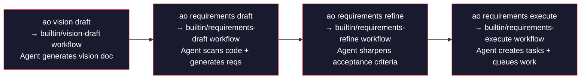

Every command dispatches a YAML workflow. The CLI streams output while the agent runs. Under the hood it's the same execution path as any other workflow.

**The hierarchy:**

| Level | Entity | Created By |
|-------|--------|-----------|
| Vision | Single document | `builtin/vision-draft` workflow |
| Requirements | REQ-001..REQ-016 | `builtin/requirements-draft` workflow |
| Tasks | TASK-001..TASK-040 | `builtin/requirements-execute` workflow (agent uses `ao.task.create` MCP tool) |

### Step 3: Daemon Picks Up Work

```bash
ao daemon start --autonomous
```

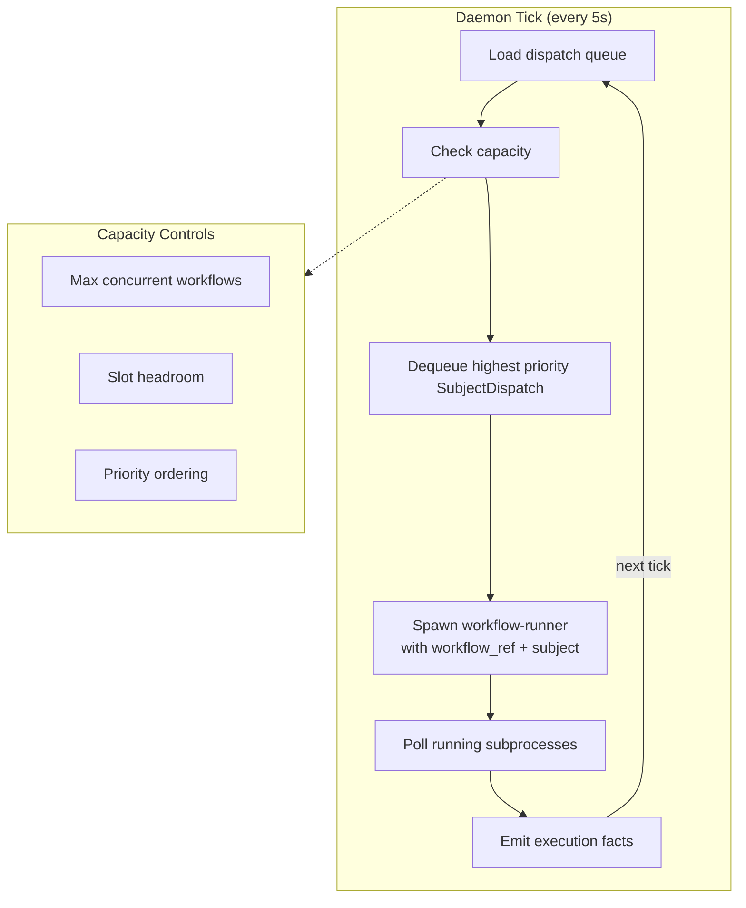

The daemon is a dumb scheduler. It doesn't know what a "task" is or what "requirements" are. It just processes `SubjectDispatch` envelopes, manages subprocess capacity, and emits facts.

### Step 4: Workflow Pipeline Executes

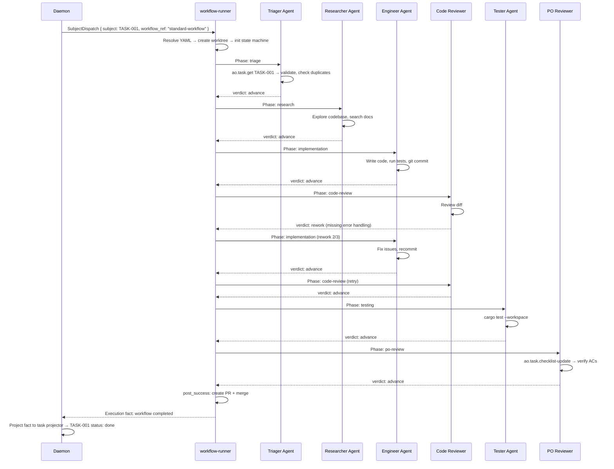

### Step 5: Agents Use MCP Tools

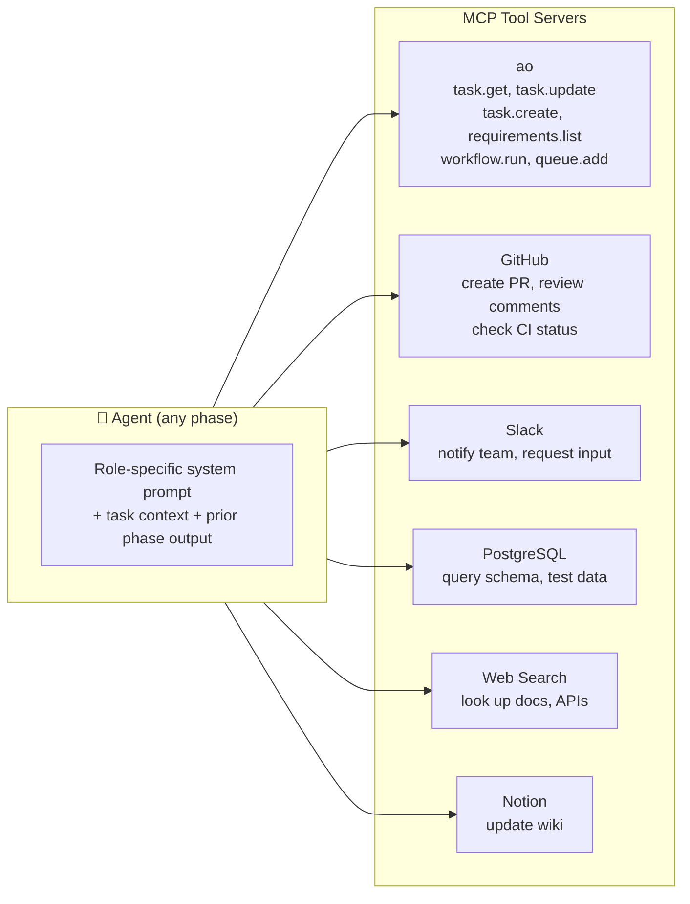

Agents mutate AO state through MCP tools, not by editing JSON files. When a `requirements-execute` agent needs to create tasks, it calls `ao.task.create`. When an engineer needs to mark a checklist item done, it calls `ao.task.checklist-update`. This keeps all state changes validated and auditable.

**MCP servers are configured in workflow YAML:**

```yaml
mcp_servers:
  ao:
    command: ao
    args: [mcp, serve]
  github:
    command: npx
    args: [-y, @modelcontextprotocol/server-github]
    env:
      GITHUB_PERSONAL_ACCESS_TOKEN: ${GITHUB_TOKEN}
  slack:
    command: npx
    args: [-y, @anthropic/mcp-server-slack]
    env:
      SLACK_BOT_TOKEN: ${SLACK_BOT_TOKEN}
```

**Agent profiles define specialized personas:**

| Agent | Role | Tools |
|-------|------|-------|
| `triager` | Validates tasks, detects duplicates | ao |
| `researcher` | Gathers evidence, explores patterns | ao, web-search |
| `senior-engineer` | Writes production code | ao, github |
| `code-reviewer` | Reviews diffs for bugs and edge cases | ao, github |
| `security-reviewer` | Validates against OWASP, secrets exposure | ao |
| `integration-tester` | Runs test suites, checks coverage | ao |
| `po-reviewer` | Verifies acceptance criteria are met | ao, notion |

### Step 6: Monitor Everything

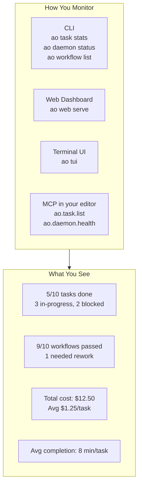

---

## The Full Lifecycle

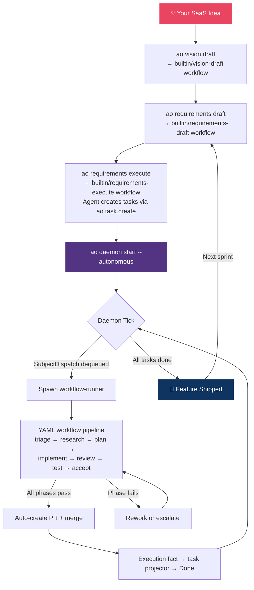

---

## CLI Command Classification

The CLI has exactly four responsibilities:

### 1. Dispatch Workflows

Commands that produce `SubjectDispatch` and execute workflows:

```bash
ao vision draft                    # → builtin/vision-draft
ao vision refine                   # → builtin/vision-refine
ao requirements draft              # → builtin/requirements-draft
ao requirements refine             # → builtin/requirements-refine
ao requirements execute            # → builtin/requirements-execute
ao workflow run                    # → user-specified workflow_ref
ao workflow execute                # → synchronous single-run execution
```

### 2. CRUD State

Commands that read/write state without AI:

```bash
ao task list/get/create/update/delete/status/assign/set-priority
ao requirements list/get/create/update/delete
ao architecture entity list/get/create/update/delete
ao review record/handoff
ao qa evaluate/approve/reject
ao workflow list/get/config/phases
```

### 3. Monitor

Commands that observe system state:

```bash
ao status                          # Unified project dashboard
ao task stats/prioritized          # Task analytics
ao daemon status/health/logs       # Daemon observability
ao workflow list/get/decisions      # Workflow progress
ao output run/monitor/tail         # Agent output streaming
ao history list/get                # Execution history
ao errors list/get                 # Error inspection
```

### 4. Infrastructure

Commands that manage the runtime:

```bash
ao setup/doctor                    # Project setup + health checks
ao daemon start/stop/pause/resume  # Daemon lifecycle
ao runner health/orphans           # Runner process management
ao queue list/add/remove           # Dispatch queue management
ao mcp start/stop/status           # MCP server lifecycle
ao web serve                       # Web dashboard
ao tui                             # Terminal UI
ao config validate/compile         # YAML config management
```

---

## Key Architecture Patterns

### Subject Dispatch

All work flows through a unified `SubjectDispatch` envelope. There is no special path for "vision" vs "task" vs "schedule" work. One envelope, one execution path.

### Dumb Daemon

The daemon is a scheduler, not a feature host. It manages capacity and subprocesses. Advanced AI logic lives in YAML workflows executed by `workflow-runner`.

### Tool-Driven Mutation

Agents mutate state through MCP tools (`ao.task.create`, `ao.requirements.refine`, etc.), not through daemon-internal logic. This keeps the daemon generic and makes all state changes auditable.

### Projectors

Execution facts from `workflow-runner` are projected back onto domain state by projectors (task projector, requirement projector, schedule projector, notification projector). The daemon emits facts; projectors interpret them.

### Isolated Worktrees

Every task executes in its own git worktree at `~/.ao/<repo-scope>/worktrees/<task-id>/`. Agents can write code, run tests, and commit without interfering with each other.

### Self-Correcting Pipelines

The rework loop is the quality guarantee. Code review sends work back to the engineer with failure context. Up to N rework cycles (configurable per phase) before escalating.

### Failure Recovery

- **Phase fails** → retried up to configured max
- **All retries exhausted** → workflow fails, execution fact emitted, task projector marks blocked
- **Daemon crashes** → orphan recovery on next startup
- **Merge conflicts** → AI-powered conflict resolution in workflow phases

---

## Workflow YAML Reference

All workflows live in `.ao/workflows/`. The YAML schema supports:

```yaml
id: my-workflow
name: My Workflow
description: What this workflow does

mcp_servers:
  ao:
    command: ao
    args: [mcp, serve]
  github:
    command: npx
    args: [-y, @modelcontextprotocol/server-github]
    env:
      GITHUB_PERSONAL_ACCESS_TOKEN: ${GITHUB_TOKEN}

agents:
  my-agent:
    model: claude-sonnet-4-6
    system_prompt: |
      You are a specialized agent...
    mcp_servers: [ao, github]

variables:
  - name: target_branch
    default: main

pipelines:
  default:
    phases:
      - id: phase-1
        agent: my-agent
        max_rework_attempts: 3
        skip_if: ["task.type == 'docs'"]
        on_verdict:
          rework: { target: phase-1 }
          advance: { target: phase-2 }
      - id: phase-2
        agent: my-agent
      - id: nested-pipeline
        sub_workflow: other-workflow-ref
    post_success:
      auto_merge: true
      auto_pr: true
      cleanup_worktree: true
```

**Supported features:**
- Sequential phase ordering
- Conditional skipping (`skip_if` guards)
- Verdict-based transitions (`on_verdict` routing)
- Rework loops (`max_rework_attempts`)
- Nested sub-workflows (`sub_workflow`)
- Pipeline variables with defaults
- Per-phase agent and model overrides
- MCP server references by name
- Post-success actions (merge, PR, cleanup)

---

## Example: A Typical Day

```
Morning:
  $ ao vision draft
  → Dispatches builtin/vision-draft workflow
  → Agent analyzes project, generates vision doc
  → Vision saved to .ao/state/vision.json

  $ ao requirements draft --include-codebase-scan
  → Dispatches builtin/requirements-draft workflow
  → Agent scans codebase, generates 12 requirements
  → Requirements saved with acceptance criteria

  $ ao requirements execute --requirement-ids REQ-001..REQ-005
  → Dispatches builtin/requirements-execute workflow
  → Agent creates 15 tasks via ao.task.create MCP tool
  → Tasks queued with priorities and dependencies

  $ ao daemon start --autonomous
  → Daemon begins tick loop, picks up queued work

Afternoon:
  $ ao task stats
  → 9 done, 4 in-progress, 2 blocked (waiting on dependency)

  $ ao workflow list --status failed
  → 1 workflow failed at security-review (hardcoded API key detected)
  → Engineer agent auto-reworked, now passing

Evening:
  $ ao task stats
  → 14 done, 1 in-progress

  $ gh pr list
  → 14 PRs ready for review
  → Review, approve, merge

Next day:
  $ ao requirements execute --requirement-ids REQ-006..REQ-010
  → Repeat cycle
```
